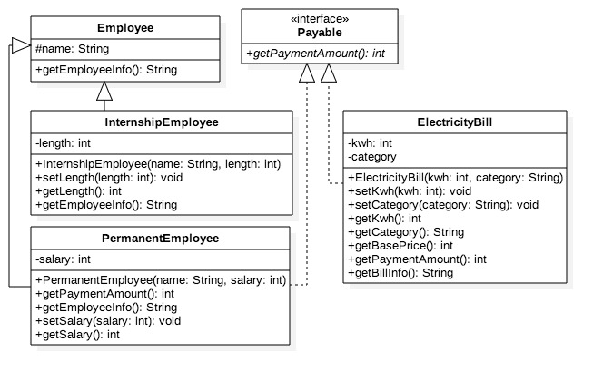
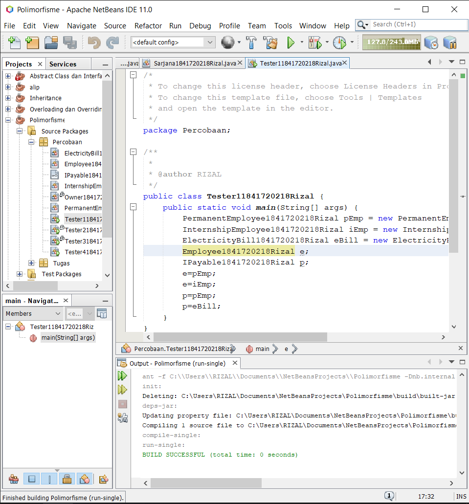
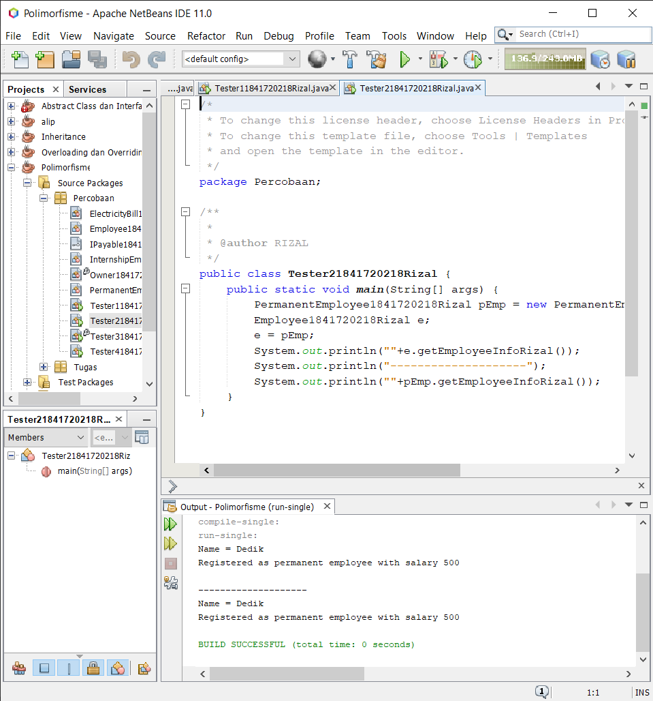
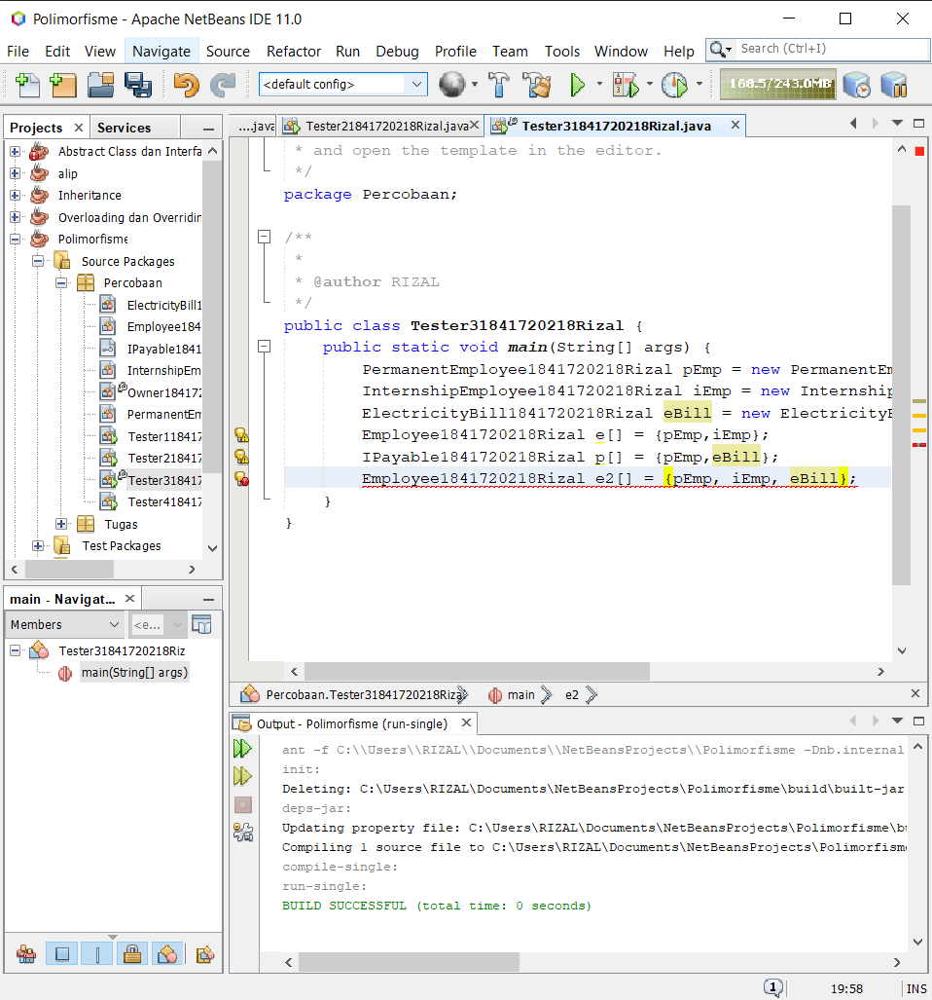
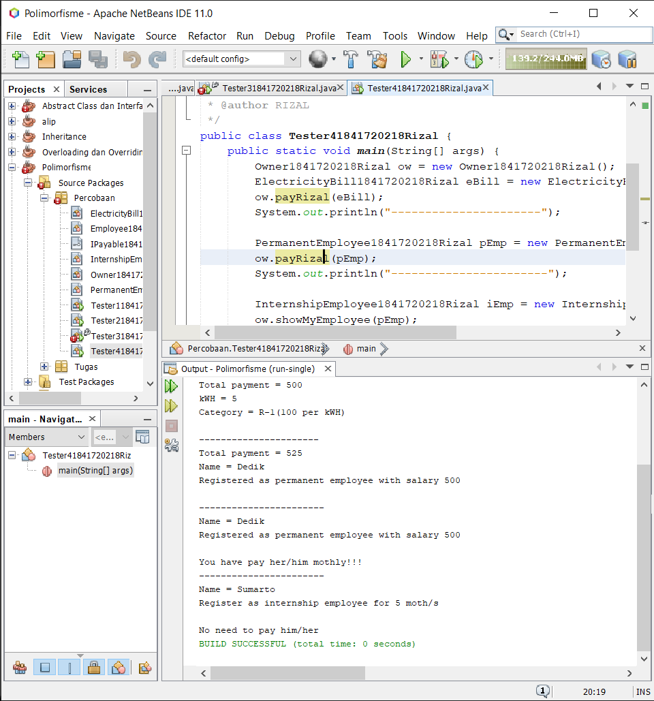
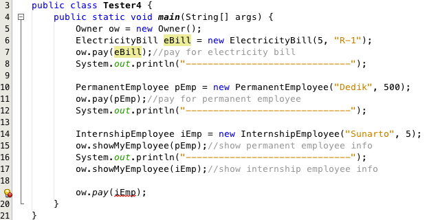
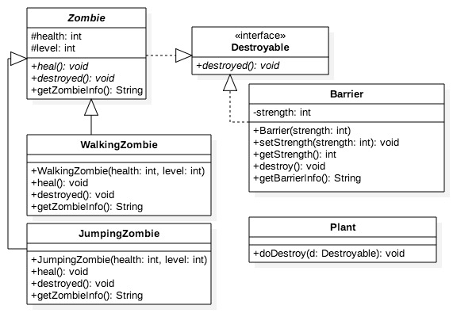
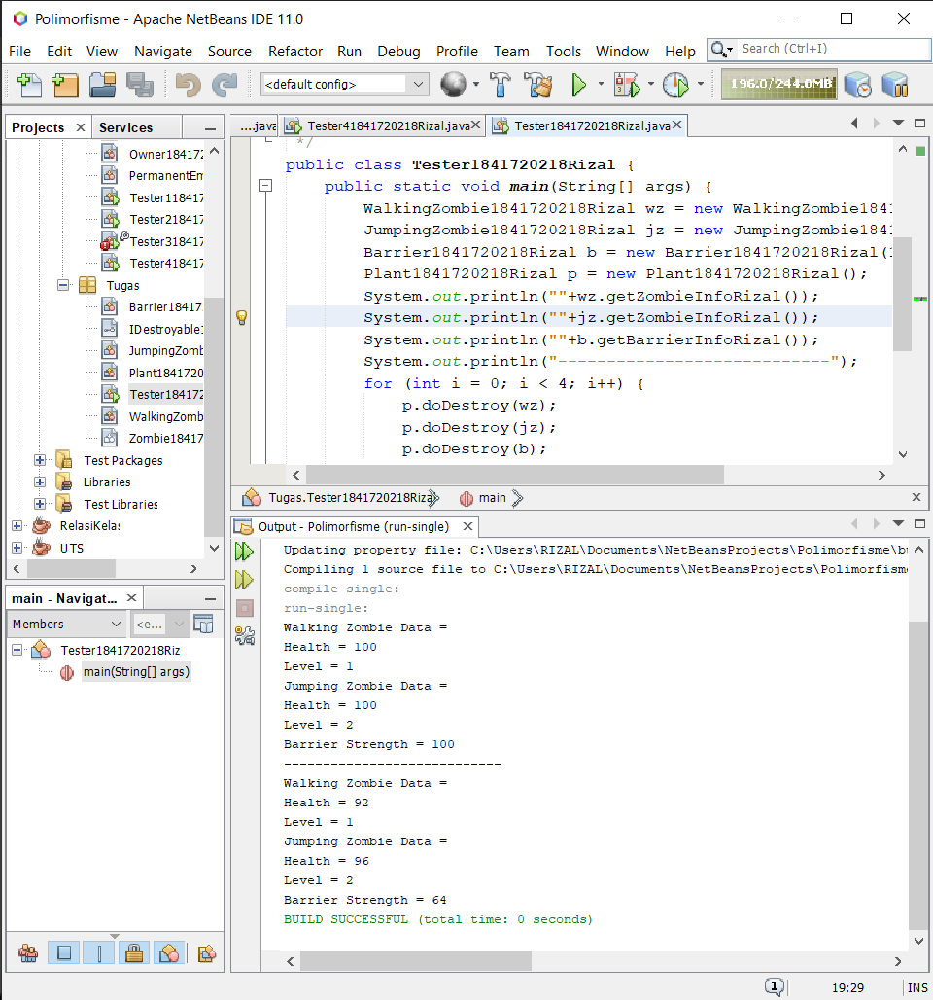

# Laporan Praktikum #10 - POLIMORFISME

## Kompetensi

Setelah melakukan percobaan pada jobsheet ini, diharapkan mahasiswa mampu:

1. Memahami konsep dan bentuk dasar polimorfisme
2. Memahami konsep virtual method invication
3. Menerapkan polimorfisme pada pembuatan heterogeneous collection
4. Menerapkan polimorfisme pada parameter/argument method
5. Menerapkan object casting untuk meng-ubah bentuk objek

## Ringkasan Materi

* Virtual method Invocation

    Virtual method invocation terjadi ketika ada pemanggilan overriding method dari suatu objek polimorfisme. Disebut virtual karena antara method yang dikenali oleh compiler dan method yang dijalankan oleh JVM berbeda

* Heterogeneous Collection

    Dengan adanya konsep polimorfisme, maka variabel array bisa dibuat heterogen. Artinya di dalam array tersebut bisa berisi berbagai macam objek yang berbeda.

* Polymorphic Argument

    Polimorfisme juga bisa diterapkan pada argument suatu method. Tujuannya agar method tersebut bisa menerima nilai argument dari berbagai bentuk objek.

* Operator instanceof

    Operator instanceof bisa digunakan untuk mengecek apakah suatu objek merupakan hasil instansiasi dari suatu class tertentu. Hasil dari instanceof berupa nilai boolean.

* Object Casting

    Casting objek digunakan untuk mengubah tipe dari suatu objek. Jika ada suatu objek dari subclass kemudian tipenya diubah ke superclass, maka hal ini termasuk ke upcasting.

## Percobaan

### Percobaan 1

`Class Diagram`

`Screenshot:`

`Kode Program:`

* [Employee1841720218Rizal](../../src/10_Polimorfisme/Percobaan/Employee1841720218Rizal.java)
* [IPayable1841720218Rizal](../../src/10_Polimorfisme/Percobaan/IPayable1841720218Rizal.java)
* [InternshipEmployee1841720218Rizal](../../src/10_Polimorfisme/Percobaan/InternshipEmployee1841720218Rizal.java)
* [PermanentEmployee1841720218Rizal](../../src/10_Polimorfisme/Percobaan/PermanentEmployee1841720218Rizal.java)
* [ElectricityBill1841720218Rizal](../../src/10_Polimorfisme/Percobaan/ElectricityBill1841720218Rizal.java)
* [Tester11841720218Rizal](../../src/10_Polimorfisme/Percobaan/Tester11841720218Rizal.java)

`Pertanyaan`

1. Class apa sajakah yang merupakan turunan dari class Employee?
2. Class apa sajakah yang implements ke interface Payable?
3. Perhatikan class Tester1, baris ke-10 dan 11. Mengapa e, bisa diisi dengan objek pEmp (merupakan objek dari class PermanentEmployee) dan objek iEmp (merupakan objek dari class InternshipEmploye) ?
4. Perhatikan class Tester1, baris ke-12 dan 13. Mengapa p, bisa diisi dengan objek pEmp (merupakan objek dari class PermanentEmployee) dan objek eBill (merupakan objek dari class ElectricityBill) ?
5. Coba tambahkan sintaks:
   * p = iEmp;
   * e = eBill;

    pada baris 14 dan 15 (baris terakhir dalam method main) ! Apa yang menyebabkan error?
6. Ambil kesimpulan tentang konsep/bentuk dasar polimorfisme!

`Jawab`

1. InternshipEmployee dan PermanentEmployee
2. PermanentEmployee dan ElectricityBill
3. karena InternshipEmployee dan PermanentEmployee meripakan child class dari Employee
4. karena PermanentEmployee dan ElectricityBill mengimplemen class Payable
5. karena tidak terdapat relasi antara class Payable dengan InternshipEmployee dan class Employee tidak terdapat relasi dengan ElectricityBill
6. referensi bisa terjadi jika referensi super class yang digunakan untuk merujuk ke objek dari sub class

### Percobaan 2

`Screenshot:`

`Kode Program:`

* [Tester21841720218Rizal](../../src/10_Polimorfisme/Percobaan/Tester21841720218Rizal.java)

`Pertanyaan`

1. Perhatikan class Tester2 di atas, mengapa pemanggilan e.getEmployeeInfo() pada baris 8 dan pEmp.getEmployeeInfo() pada baris 10 menghasilkan hasil
sama?
2. Mengapa pemanggilan method e.getEmployeeInfo() disebut sebagai pemanggilan method virtual (virtual method invication), sedangkan pEmp.getEmployeeInfo() tidak?
3. Jadi apakah yang dimaksud dari virtual method invocation? Mengapa disebut virtual?

`Jawab`

1. Karena Employee mereferensikan atau diisi dengan objek PermanentEmployee
2. Karena method e.getEmployeeInfo() saat dijalankan akan menjalankan method getEmployeeInfo() yang ada pada class PermanentEmployee terjadi karena ada pemanggilan overriding method dari suatu objek polimorfisme
3. Virtual Method Invocation (VMI) bisa terjadi jika terjadi polimorfisme dan overriding. Pada saat obyek yang sudah dibuat tersebut memanggil overridden method pada parent class, kompiler Java akan melakukan invocation (pemanggilan) terhadap overriding method pada subclass, dimana yang seharusnya dipanggil adalah overridden method.

### Percobaan 3

`Screenshot:`

`Kode Program:`

* [Tester31841720218Rizal](../../src/10_Polimorfisme/Percobaan/Tester31841720218Rizal.java)

`Pertanyaan`

1. Perhatikan array e pada baris ke-8, mengapa ia bisa diisi dengan objek-objek dengan tipe yang berbeda, yaitu objek pEmp (objek dari PermanentEmployee) dan objek iEmp (objek dari InternshipEmployee) ?
2. Perhatikan juga baris ke-9, mengapa array p juga biisi dengan objekobjek dengan tipe yang berbeda, yaitu objek pEmp (objek dari PermanentEmployee) dan objek eBill (objek dari ElectricityBilling) ?
3. Perhatikan baris ke-10, mengapa terjadi error?

`Jawab`

1. Karena PermanentEmployee dan InternshipEmployee merupakan child class dari Employee
2. karena PermanentEmployee dan ElectricityBill mengimplemen class Payable
3. Karena eBill tidak memilki hibungan dengan class Employee (inheritance/implements)

### Percobaan 4

`Screenshot:`

`Kode Program:`

* [Owner1841720218Rizal](../../src/10_Polimorfisme/Percobaan/Owner1841720218Rizal.java)
* [Tester41841720218Rizal](../../src/10_Polimorfisme/Percobaan/Tester41841720218Rizal.java)

`Pertanyaan`

1. Perhatikan class Tester4 baris ke-7 dan baris ke-11, mengapa pemanggilan ow.pay(eBill) dan ow.pay(pEmp) bisa dilakukan, padahal jika diperhatikan method pay() yang ada di dalam class Owner memiliki argument/parameter bertipe Payable? Jika diperhatikan lebih detil eBill merupakan objek dari ElectricityBill dan pEmp merupakan objek dari PermanentEmployee?
2. Jadi apakah tujuan membuat argument bertipe Payable pada method pay() yang ada di dalam class Owner?
3. Coba pada baris terakhir method main() yang ada di dalam class Tester4 ditambahkan perintah ow.pay(iEmp);

Mengapa terjadi error?
4. Perhatikan class Owner, diperlukan untuk apakah sintaks p instanceof ElectricityBill pada baris ke-6 ?
5. Perhatikan kembali class Owner baris ke-7, untuk apakah casting objek disana (ElectricityBill eb = (ElectricityBill) p) diperlukan ? Mengapa objek p yang bertipe Payable harus di-casting ke dalam objek eb yang bertipe ElectricityBill ?

`Jawab`

1. karena PermanentEmployee dan ElectricityBill mengimplemen class Payable
2. Supaya method pay() hanya bisa dijalankan pada class yang mengimplement Payable
3. karena class InternshipEmployee tida mengimplement Payable
4. untuk mengecek hubungan apakah objek p yang merupakan hasil instansiasi dari interface Payable terhadap class ElectricityBill
5. Untuk dikembalikan ke instansiasi sesungguhnya sehingga dapat memanggil method getBillInfo() yang hanya ada di class ElectricityBill

## Tugas

`Class Diagram`

`Screenshot:`

`Kode Program:`

* [Barrier1841720218Rizal](../../src/10_Polimorfisme/Tugas/Barrier1841720218Rizal.java)
* [IDestroyable1841720218Rizal](../../src/10_Polimorfisme/Tugas/IDestroyable1841720218Rizal.java)
* [JumpingZombie1841720218Rizal](../../src/10_Polimorfisme/Tugas/JumpingZombie1841720218Rizal.java)
* [Plant1841720218Rizal](../../src/10_Polimorfisme/Tugas/Plant1841720218Rizal.java)
* [Tester1841720218Rizal](../../src/10_Polimorfisme/Tugas/Tester1841720218Rizal.java)
* [WalkingZombie1841720218Rizal](../../src/10_Polimorfisme/Tugas/WalkingZombie1841720218Rizal.java)
* [Zombie1841720218Rizal](../../src/10_Polimorfisme/Tugas/Zombie1841720218Rizal.java)

## Kesimpulan

Polimorfisme bisa dilakukan asalkan subclass sudah mengextends superclass (class biasa maupun abstract class) maupun implements satu atau lebih interface. Sebuha objek subclass bisa berubah tipe data menjadi superclass dengan cara upcasting dan sebaliknya objek dari superclass juga bisa downcast menjadi bertipe data subclass. Ketik terjadi casting dan memanggil method pada objek tersebut maka method yang tampil adalah method pada class setelah casting.

## Pernyataan Diri

Saya menyatakan isi tugas, kode program, dan laporan praktikum ini dibuat oleh saya sendiri. Saya tidak melakukan plagiasi, kecurangan, menyalin/menggandakan milik orang lain.

Jika saya melakukan plagiasi, kecurangan, atau melanggar hak kekayaan intelektual, saya siap untuk mendapat sanksi atau hukuman sesuai peraturan perundang-undangan yang berlaku.

Ttd,

***Rizal Anhari***