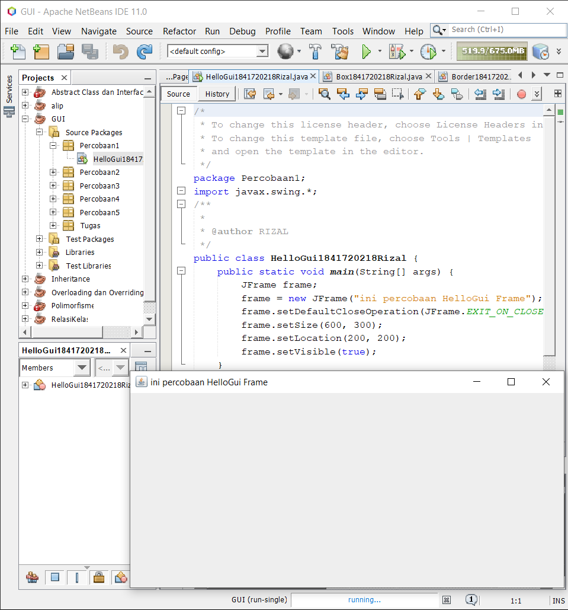
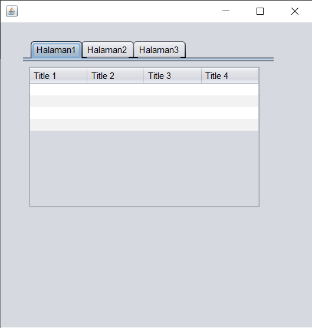

# Laporan Praktikum #11 - GUI (Graphical User Interface)

## Kompetensi

Setelah menyelesaikan lembar kerja ini mahasiswa diharapkan mampu:

1. Membuat aplikasi Graphical User Interface sederhana dengan bahasa pemrograman java;
2. Mengenal komponen GUI seperti frame, label, textfield, combobox, radiobutton, checkbox, textarea, menu, serta table;
3. Menambahkan event handling pada aplikasi GUI.

## Ringkasan Materi

Dalam pemrograman GUI terdapat beberapa bagian yang harus dilakukan yaitu:

1. Membuat windows utama
2. Menentukan komponen-komponen pendukung program
3. Menentukan tata letak layout agar nantinya semua komponen – komponen yang sudah dipersiapkan bisa diaatur sedemikian rupa
4. Event Handling dari sebuah aktivitas, seperti penekanan button, check box dan lain-lain


Java Swing merupakan bagian dari JFC (Java Foundation Classes) yang menyediakan API untuk menangani hal yang berkaitan dengan GUI bagi program Java. Kita bisa membedakan komponen Swing dengan komponen AWT, di mana pada umumnya kelas-kelas yang berada dalam komponen Swing diawali dengan huruf J, misal: JButton, JLabel, JTextField, JRadioButton.

## Percobaan

### Percobaan 1

`Screenshot:`



`Kode Program:`

* [HelloGui1841720218Rizal](../../src/11_GUI/Percobaan1/HelloGui1841720218Rizal.java)

### Percobaan 2

`Screenshot:`


`Kode Program:`

* [MyInputForm1841720218Rizal](../../src/11_GUI/Percobaan2/MyInputForm1841720218Rizal.java)

`Pertanyaan`

1. Modifikasi kode program dengan menambahkan JButton baru untuk melakukan fungsi
perhitungan penambahan, sehingga ketika button di klik (event click) maka akan
menampilkan hasil penambahan dari nilai A dan B

`Jawab`


[MyInputForm1841720218Rizal](../../src/11_GUI/PertanyaanPercobaan2/MyInputForm1841720218Rizal.java)


### Percobaan 3

`Screenshot:`


`Kode Program:`

* [Border1841720218Rizal](../../src/11_GUI/Percobaan3/Border1841720218Rizal.java)
* [Box1841720218Rizal](../../src/11_GUI/Percobaan3/Box1841720218Rizal.java)
* [Grid1841720218Rizal](../../src/11_GUI/Percobaan3/Grid1841720218Rizal.java)
* [LayoutGUI1841720218Rizal](../../src/11_GUI/Percobaan3/LayoutGUI1841720218Rizal.java)

`Pertanyaan`

1. Apa perbedaan dari Grid Layout, Box Layout dan Border Layout?
2. Apakah fungsi dari masing-masing kode berikut?

    

`Jawab`

1. Perbedaan:

   * Grid layout menampilkan/membagi layout menjadi seperti tabel yaitu baris dan kolom
   * Box layout menampikan/membagi layout dalam satu kolom
   * Border layout membagi layout menjadi 5 bagian yaitu north, east, sout, west, center

2. Fungsi:

    * setDefaultCloseOperation : untuk mengatur/memilih cara pehentian program
    * JFrame.EXIT_ON_CLOSE : untuk menghentikan program jika menekan tombol close
    * setVisible: menampilkan frame

### Percobaan 4

`Screenshot:`


`Kode Program:`

* [Swing1841720218Rizal](../../src/11_GUI/Percobaan4/Swing1841720218Rizal.form)
* [Swing1841720218Rizal](../../src/11_GUI/Percobaan4/Swing1841720218Rizal.java)

`Pertanyaan`

1. Apakah fungsi dari kode berikut?

    
2. Mengapa pada bagian logika checkbox dan radio button digunakan multiple if ?
3. Lakukan modifikasi pada program untuk melakukan menambahkan inputan berupa alamat dan berikan fungsi pemeriksaan pada nilai Alamat tersebut jika belum diisi dengan menampilkan pesan peringatan

`Jawab`

1. untuk menjalankan, membuat dan menampilkan from
2. karena setiap checkbok atau radiobutton memiliki isi yang berbeda
3. Kode:

    

    ```
     private void cmdtampilActionPerformed(java.awt.event.ActionEvent evt) {                                          
        nama = txtname.getText();
        nim = txtnim.getText();
        alamat = txtalamat.getText();
        if (cbMK1.isSelected()) {
            matakuliah = "Sistem terdistribusi";
        }
        if (cbMK2.isSelected()) {
            matakuliah = "PBO";
        }

        if (rdjeniskelamin1.isSelected()) {
            jeniskelamin = "Laki-laki";
        }
        if (rdjeniskelamin2.isSelected()) {
            jeniskelamin = "Perempuan";
        }
     
        jurusan = listjurusan.getSelectedValue().toString();
        semester = comboboxsemester.getSelectedItem().toString();

        info = "Nama      : " + nama + "\n";
        info += "NIM      : " + nim + "\n";
        info += "Jenis Kelamin        : " + jeniskelamin + "\n";
        info += "Jurusan      : " + jurusan + "\n";
        info += "Semester     : " + semester + "\n";
        info += "Mata Kuliah      : " + matakuliah + "\n";
        info += "Alamat     : "+alamat+"";
        hasil.setText(info);
        if (txtalamat.getText().equals("")) {
            JOptionPane.showMessageDialog(null, "Alamat Masih Kosong");
        }
        JOptionPane.showMessageDialog(null, info);
    }
    ```

### Percobaan 5

`Screenshot:`


`Kode Program:`

* [Swing2](../../src/11_GUI/Percobaan5/Swing2.form)
* [Swing2](../../src/11_GUI/Percobaan5/Swing2.java)

`Pertanyaan`

1. Apa kegunaan komponen swing JTabPane, JTtree, pada percobaan 5?
2. Modifikasi program untuk menambahkan komponen JTable pada tab Halaman 1 dan tab Halaman 2

`Jawab`

1. Fungsi:

    * JTabPane: untuk membuat panel berbentuk tab atau halaman
    * JTree: untuk menampilkan data dengan hirarki properti dengan menambahkan node ke node dan menyimpan konsep induk dan anak node
2. Hasil

   

## Tugas

`Screenshot:`


`Kode Program:`

* [Kalkulator1841720218Rizal](../../src/11_GUI/Tugas/Kalkulator1841720218Rizal.form)
* [Kalkulator1841720218Rizal](../../src/11_GUI/Tugas/Kalkulator1841720218Rizal.java)

## Kesimpulan

* Belajar JFrame.
* Belajar Menangani Input Pada GUI.
* Belajar Manajemen Layout:
* Border Layout.
* Grid Layout.
* Box Layout.
* Belajar Membuat GUI Melalui IDE Netbeans.
* Belajar Membuat JTabPane, JTtree, JTable.
* Membuat kalkulator dengan GUI.

## Pernyataan Diri

Saya menyatakan isi tugas, kode program, dan laporan praktikum ini dibuat oleh saya sendiri. Saya tidak melakukan plagiasi, kecurangan, menyalin/menggandakan milik orang lain.

Jika saya melakukan plagiasi, kecurangan, atau melanggar hak kekayaan intelektual, saya siap untuk mendapat sanksi atau hukuman sesuai peraturan perundang-undangan yang berlaku.

Ttd,

***Rizal Anhari***