# Laporan Praktikum #11 - Java API

## Kompetensi

Setelah menyelesaikan lembar kerja ini mahasiswa diharapkan mampu:

1. Memahami cara penyimpanan objek menggunakan Collection dan Map.
2. Mengetahui pengelompokan dari Collection.
3. Mengetahui perbedaan dari interface Set, List dan Map.
4. Mengetahui penggunaan class-class dari interface Set, List, dan Map.
5. Memahami koneksi database menggunakan JDBC dan JDBC API

## Ringkasan Materi

Collection terbagi menjadi 3 kelompok yaitu

1. Set

    Set mengikuti model himpunan, dimana objek/anggota yang tersimpan dalam Set harus unik. Urutan maupun letak dari anggota tidak penting, hanya keberadaan anggota saja yang penting.

2. List

    List digunakan untuk menyimpan sekumpulan objek berdasarkan urutan masuk (ordered) dan menerima duplikat. Cara penyimpanannya seperti array, oleh sebab itu memiliki posisi awal dan posisi akhir, menyisipkan objek pada posisi tertentu, mengakses dan menghapus isi list, dimana semua proses ini selalu didasarkan pada urutannya.

3. Map

    Perbedaaan mendasar map dengan collection yang lain, untuk menyimpan objek pada Map, perlu sepasang objek, yaitu key yang bersifat unik dan nilai yang disimpan. Untuk mengakses nilai tersebut maka kita perlu mengetahui key dari nilai tersebut. Map juga dikenal sebagai dictionary/kamus. Pada saat menggunakan kamus, perlu suatu kata yang digunakan untuk pencarian.

## Percobaan

### Percobaan 1

`Screenshot:`

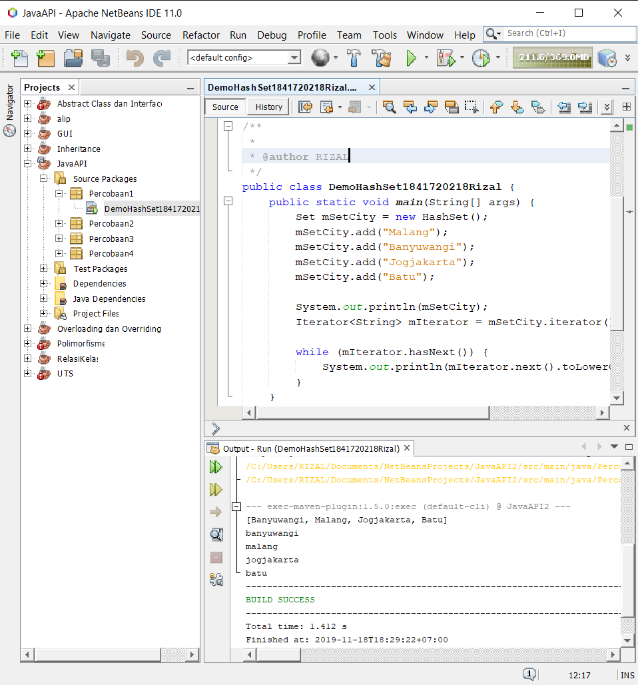

`Kode Program:`

* [DemoHashSet1841720218Rizal](../../src/12_Java_API/Percobaan1/DemoHashSet1841720218Rizal.java)

`Pertanyaan`

1. Apakah fungsi import java.util.*; pada program diatas!
2. Pada baris program keberapakah yang berfungsi untuk menciptakan object HashSet?
3. Apakah fungsi potongan program dibawah ini pada percobaan 1!
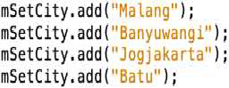 
4. Tambahkan set.add(“Malang”); kemudian jalankan program! Amati hasilnya dan jelaskan mengapa terjadi error!
5. Jelaskan fungsi potongan program dibawah ini pada percobaan 1!
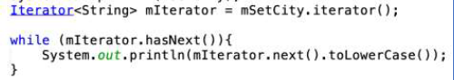 

`Jawab`

1. untuk mengimport semua library yg ada pada java.util
2. Set mSetCity = new HashSet();
3. untuk memasukkan data ke Objeck HashSet
4. karena data tersebut sama, set harus unik
5. menampilkan nilai dengan lowercase

### Percobaan 2

`Screenshot:`

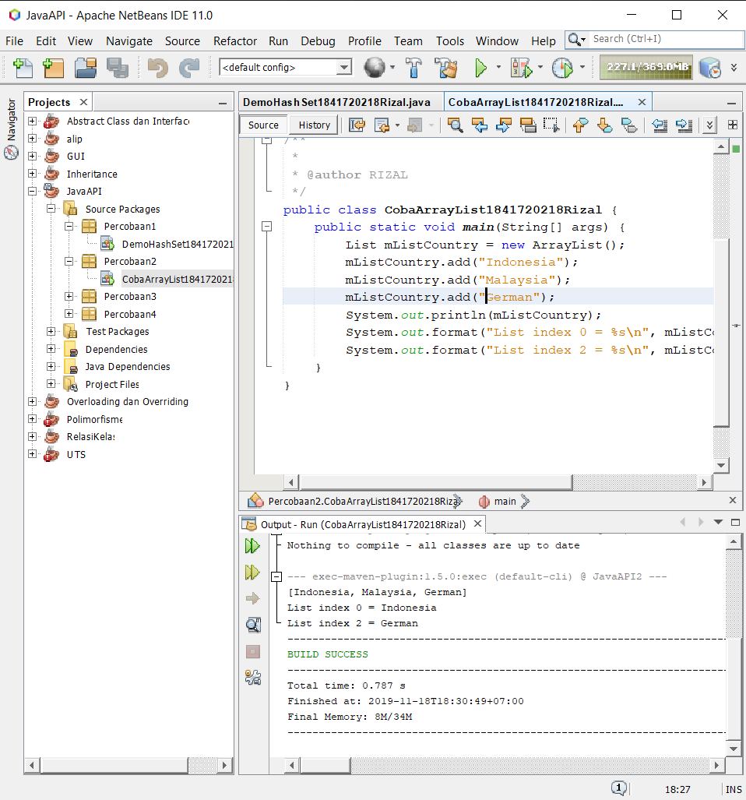

`Kode Program:`

* [CobaArrayList1841720218Rizal](../../src/12_Java_API/Percobaan2/CobaArrayList1841720218Rizal.java)

`Pertanyaan`

1. Apakah fungsi potongan program dibawah ini!
    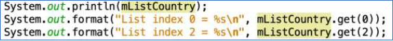 
2. Ganti potongan program pada soal no 1 menjadi sebagai berikut
    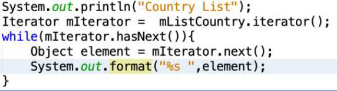 
3. Jelaskan perbedaan menampilkan data pada ArrayList menggunakan potongan program pada soal no 1 dan no 2!

`Jawab`

1. mListCountry.get(x) untuk menampilkan data pada index ke x
2. 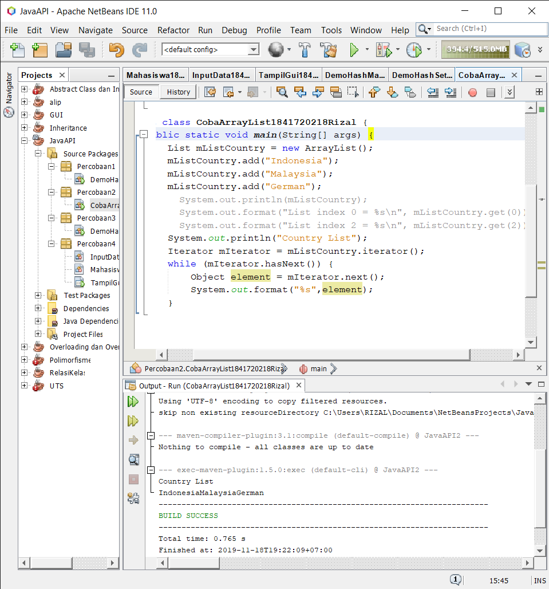 
3. Soal no 1 menggunakan input data index array, soal no 2 menggunakan iterasi jika ada data maka akan di tampilkan secara urut, jika tidak ada data maka proses iterasi akan berhenti

### Percobaan 3

`Screenshot:`

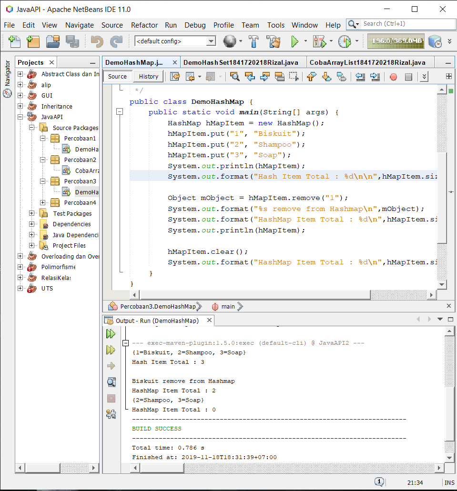

`Kode Program:`

* [DemoHashMap](../../src/12_Java_API/Percobaan3/DemoHashMap.java)

`Pertanyaan`

1. Jelaskan fungsi hMapItem.put("1","Biskuit") pada program!
2. Jelaskan fungsi hMapItem.size() pada program!
3. Jelaskan fungsi hMapItem.remove("1") pada program!
4. Jelaskan fungsi hMapItem.clear() pada program!
5. Tambahkan kode program yang di blok pada program yang sudah anda buat!
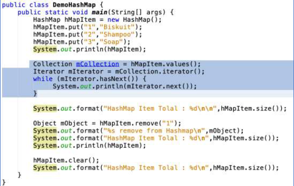
6. Jalankan program dan amati apa yang terjadi!

`Jawab`

1. digunakan untuk memasukkan data dengan key nya
2. untuk jumlah data berseta key nya pada map
3. menghapus data dengan key "1"
4. menghapus semua data pada map
5. OK
6. 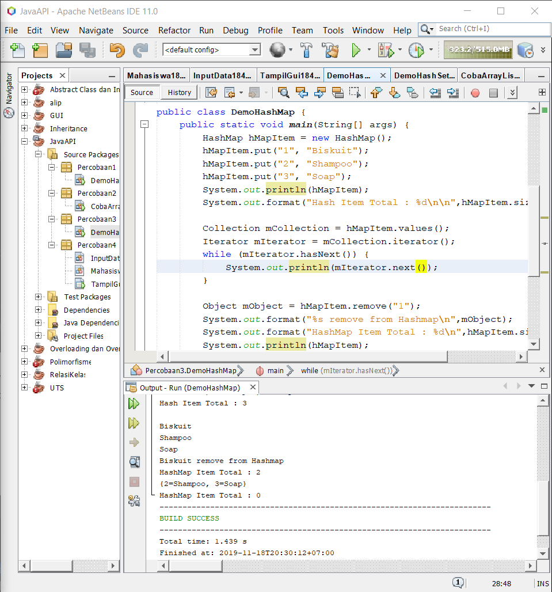
7. Menampilkan data menggunakan Iterator 

### Percobaan 4

`Screenshot:`

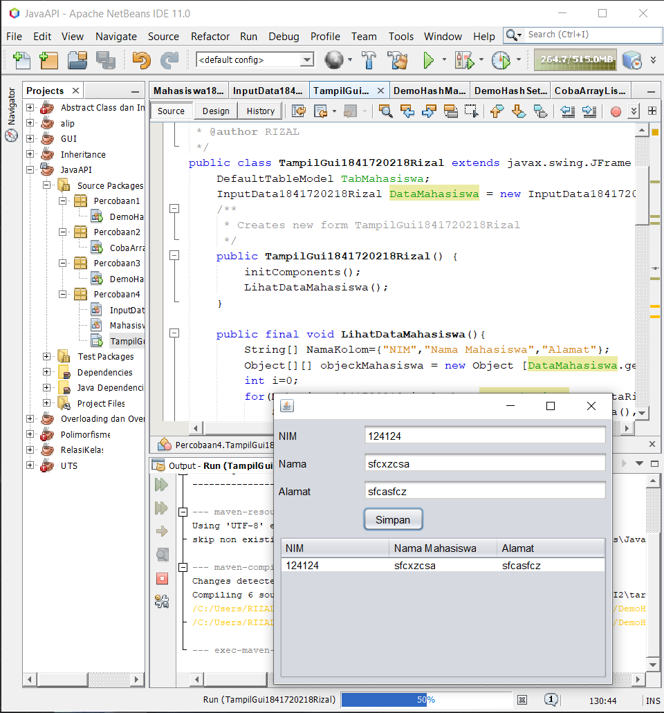

`Kode Program:`

* [InputData1841720218Rizal](../../src/12_Java_API/Percobaan4/InputData1841720218Rizal.java)
* [Mahasiswa1841720218Rizal](../../src/12_Java_API/Percobaan4/Mahasiswa1841720218Rizal.java)
* [TampilGui1841720218Rizal](../../src/12_Java_API/Percobaan4/TampilGui1841720218Rizal.java)
* [TampilGui1841720218Rizal](../../src/12_Java_API/Percobaan4/TampilGui1841720218Rizal.form)

### Percobaan 5

`Screenshot:`

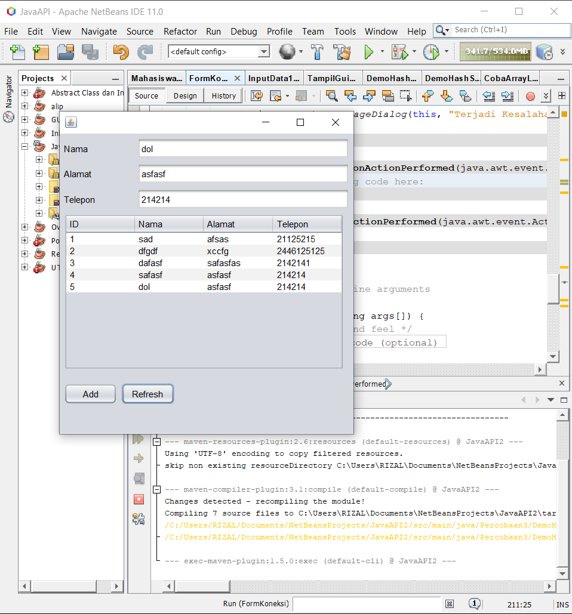

`Kode Program:`

* [FormKoneksi1841720218Rizal](../../src/12_Java_API/Percobaan5/FormKoneksi1841720218Rizal.form)
* [FormKoneksi1841720218Rizal](../../src/12_Java_API/Percobaan5/FormKoneksi1841720218Rizal.java)

`Pertanyaan`

5. Setelah menambah code pada action button klik, coba jalankan program dan tambahkan data. Apakah program berhasil menambahkan data? Jika tidak apakah penyebabnya.
6. Jelaskan maksud source code untuk melakukan insert data diatas?
9. Jelaskan alur dari method ambil_data_tabel?
10. Buat fungsi untuk merefresh sehingga data yang baru dapat ditampilkan pada tabel.

`Jawab`

5. Berhasil menambahkan data di database tetapi tidak muncul dalam tabel biodata
6. untuk memasukkan data ke database menggunakan bahasa sql
9. 
10. ```
    private void jButtonRefreshActionPerformed(java.awt.event.ActionEvent evt) {                                               
        ambil_data_tabel();
    }
    ```

## Kesimpulan

Mengetahu apa saja yang ada pada collection dam mengetahui cara memakainya serta fungsinya

## Pernyataan Diri

Saya menyatakan isi tugas, kode program, dan laporan praktikum ini dibuat oleh saya sendiri. Saya tidak melakukan plagiasi, kecurangan, menyalin/menggandakan milik orang lain.

Jika saya melakukan plagiasi, kecurangan, atau melanggar hak kekayaan intelektual, saya siap untuk mendapat sanksi atau hukuman sesuai peraturan perundang-undangan yang berlaku.

Ttd,

***Rizal Anhari***