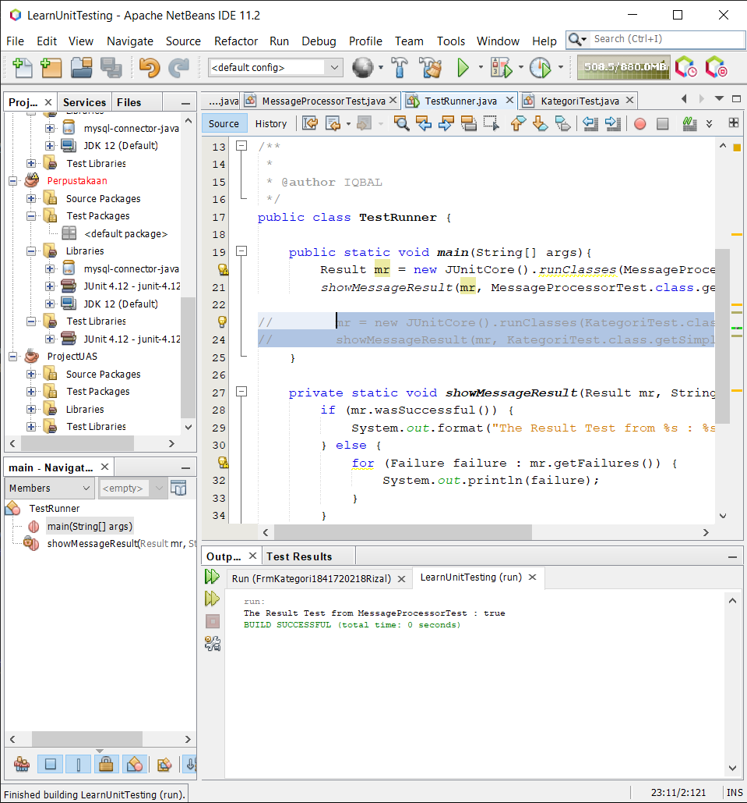
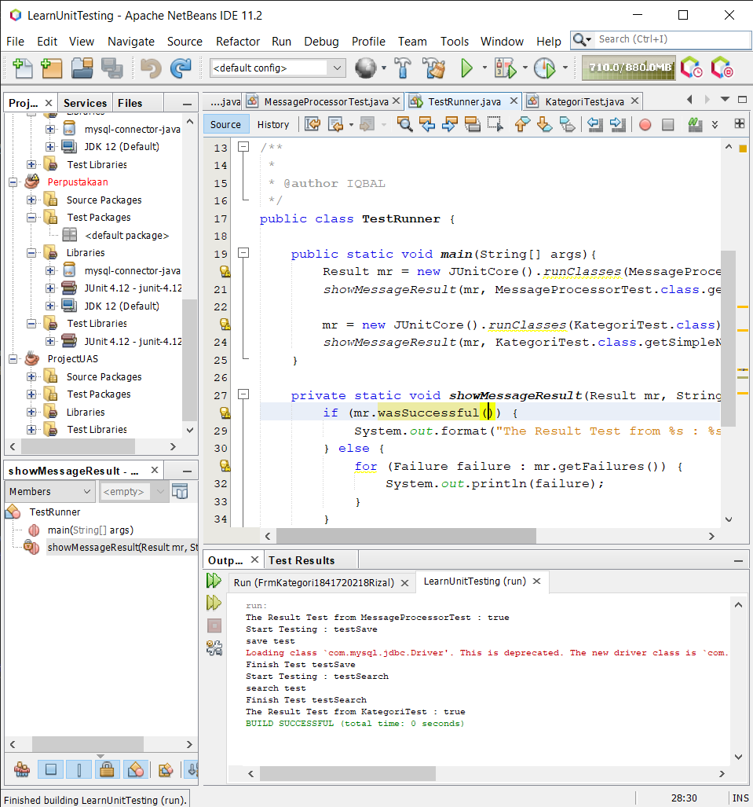

# Laporan Praktikum #15 - Unit Testing
## Kompetensi

Setelah menyelesaikan lembar kerja ini mahasiswa diharapkan mampu:

1. Memahami konsep dan fungsi unit testing
2. Menerapkan unit testing dengan JUnit pada program sederhana.
3. Menerapkan unit testing dengan JUnit pada progam yang terkoneksi database

## Ringkasan Materi

Mengenal Unit Testing dengan JUnit

Dalam Software Development Life Cycle, testing merupakan fase yang cukup penting. Dari fase ini kita akan mengetahui mutu dari aplikasi yang kita buat. Apakah aplikasi yang kita buat relevan dengan kebutuhan user, apakah aplikasi yang kita buat bebas dari bug, apakah aplikasi kita konsisten outputnya, dsb akan terjawab pada fase testing ini.

Ada 2 jenis method testing yang umum digunakan yaitu Black Box Testing dan White Box Testing.

* Black Box Testing Menurut Myers (1979) : Proses menjalankan program dengan maksud menemukan kesalahan. Menurut IEEE (1990) : Pengujian yang mengabaikan mekanisme internal sistem atau komponen dan fokus semata-mata pada output yang dihasilkan yang merespon input yang dipilih dan kondisi eksekusi.

* White Box Testing Metode perancangan test case yang menggunakan struktur kontrol dari perancangan prosedural untuk mendapatkan test case. Digunakan untuk mengetahui cara kerja internal suatu perangkat lunak. Pengujian dilakukan untuk menjamin operasi-operasi internal sesuai dengan spesifikasi yang telah ditetapkan dengan menggunakan struktur kendali dari prosedur yang dirancang.

Pada bahasa pemrograman java, telah dibuat suatu library untuk menangani unit testing. Salah satu yang cukup mainstream yaitu JUnit.

Menggunakan JUnit sebenarnya cukup simple dan mudah. Prinsip utama JUnit adalah buat test class untuk setiap class yang anda buat. Dan uji semua method yang ada pada class tersebut. JUnit juga sudah built in di beberapa IDE seperti Blue J dan Eclipse. Apabila anda menggunakan netbeans, memang anda harus mendownloadnya jar nya dulu namun setelah itu netbeans bisa me-generate test class sesuai dengan 

## Percobaan

### Percobaan 1

`Screenshot:`

`Kode Program:`

* [MessageProcessorTest](../../src/15_Unit_Testing/MessageProcessorTest.java)
* [TestRunner](../../src/15_Unit_Testing/TestRunner.java)

### Percobaan 2

`Screenshot:`

* [MessageProcessorTest](../../src/15_Unit_Testing/MessageProcessorTest.java)
* [TestRunner](../../src/15_Unit_Testing/TestRunner.java)
* [TestRunner](../../src/15_Unit_Testing/database/KategoriTest.java)

## Kesimpulan

Pada jobsheet ini kita dapat mengetahui,

* Konsep dan fungsi unit testing itu sendiri,
* Menerapkan unit testing dengan JUnit pada program sederhana,
* Menerapkan unit testing dengan JUnit pada progam yang terkoneksi database;

## Pernyataan Diri

Saya menyatakan isi tugas, kode program, dan laporan praktikum ini dibuat oleh saya sendiri. Saya tidak melakukan plagiasi, kecurangan, menyalin/menggandakan milik orang lain.

Jika saya melakukan plagiasi, kecurangan, atau melanggar hak kekayaan intelektual, saya siap untuk mendapat sanksi atau hukuman sesuai peraturan perundang-undangan yang berlaku.

Ttd,

***(Muhammad Rizqi Mahendra)***

