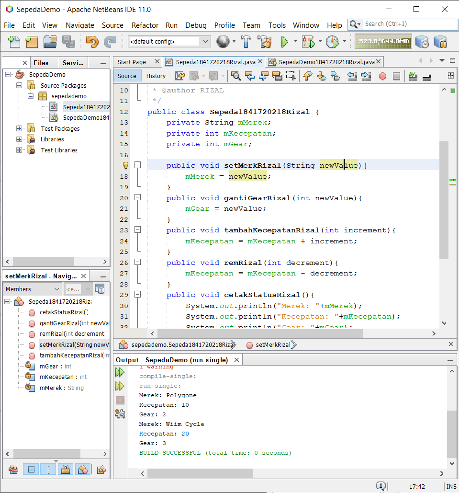
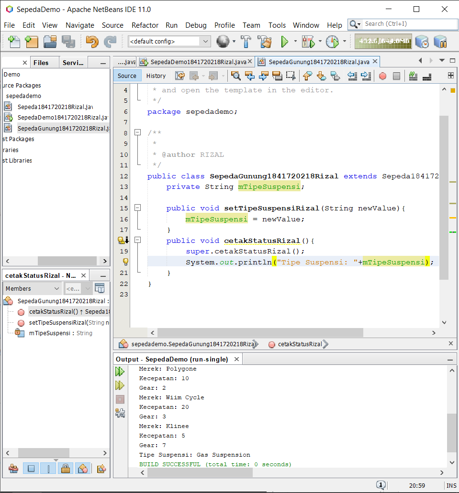
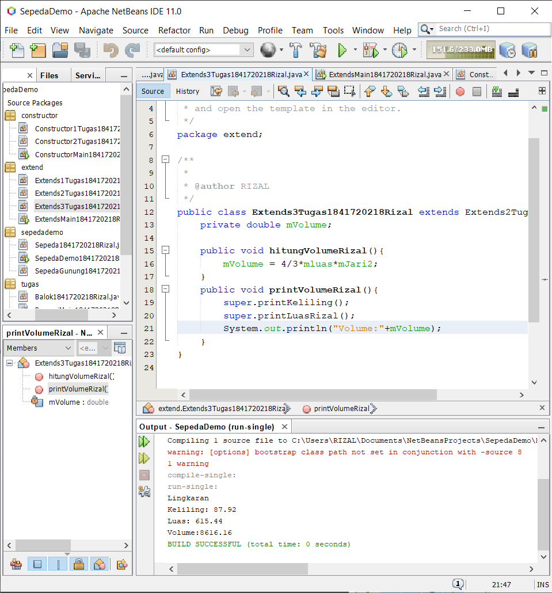
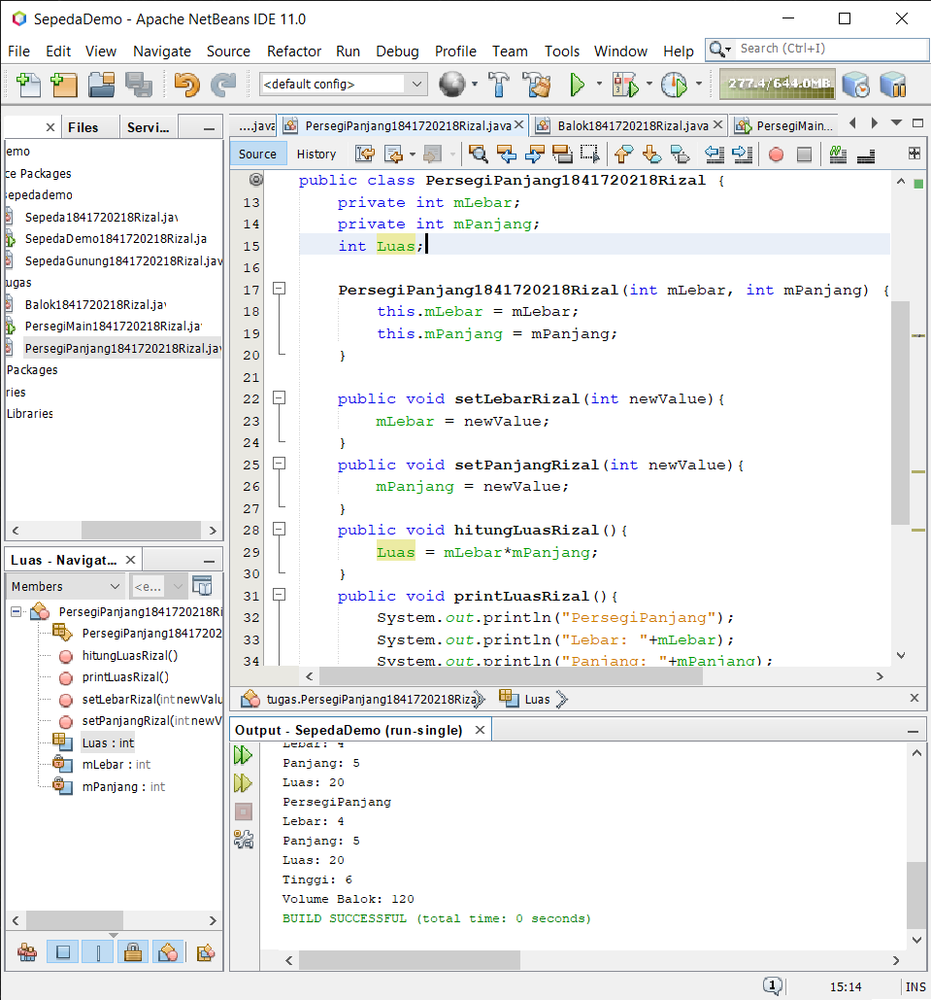
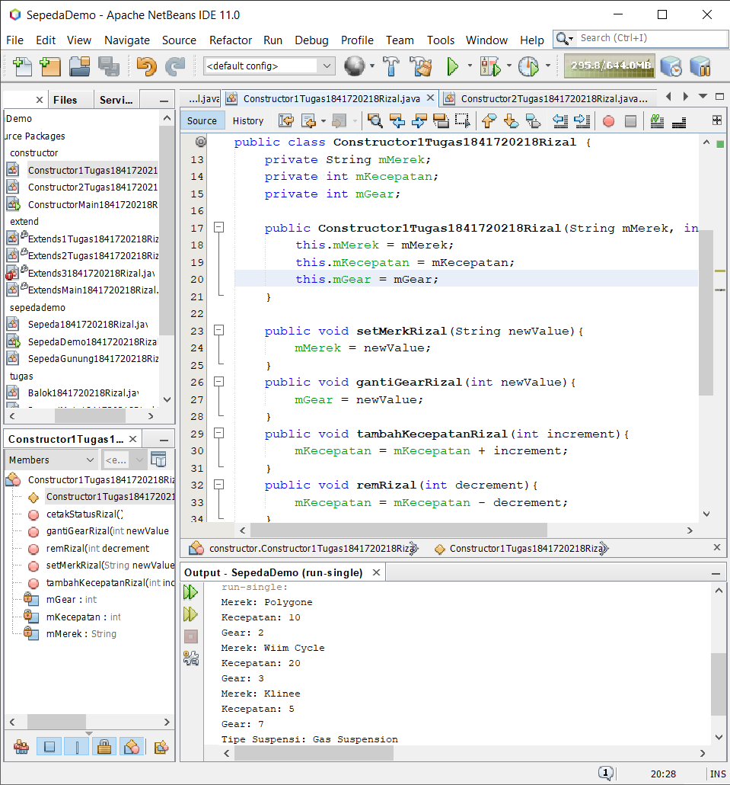

# Laporan Praktikum #1 - Pengantar Konsep PBO

## Kompetensi

1. Perbedaan paradigma berorientasi objek dengan paradigma struktural

2. Konsep dasar PBO

## Ringkasan Materi

1. Object
Object adalah suatu rangkaian dalam program yang terdiri dari state dan behaviour

2. Class
Class adalah blueprint atau prototype dari objek.

3. Enkapsulasi
metoda untuk mengatur struktur class dengan cara menyembunyikan alur kerja dari class tersebut

4. Inheritance
konsep pemrograman dimana sebuah class dapat menurunkan variable dan method yang dimilikinya kepada class lain

5. Polimorfism
suatu obyek yang memiliki sifat yang sama dengan parent nya atau pada class nya sendiri

## Percobaan

### Percobaan 1

Mendemostrasikan bagaimana membuat class, membuat objek kemudian mengakses method didalam class Sepeda1841727218Rizal

[kode program](../../src/1_Pengantar_Konsep_PBO/sepedademo/Sepeda1841720218Rizal.java)

### Percobaan 2

Membuat class SepedaGunung1841720218Rizal yang mana adalah turunan/warisan dari class Sepeda1841720218Rizal, dan membuat method setTipeSuspensiRizal

[kode program](../../src/1_Pengantar_Konsep_PBO/sepedademo/SepedaGunung1841720218Rizal.java)

## Kesimpulan

SepedaGunung pada dasarnya adalah sama dengan Sepeda (memiliki gear, memiliki kecepatan, dapat menambah kecepatan, dapat mengerem, pindah gigi, dsb) namun ada fitur tambahan yaitu tipe suspensi. Maka kita tidak perlu membuat class SepedaGunung dari nol, kita extends atau wariskan saja dari class Sepeda, kemudian kita tinggal tambahkan fitur yang sebelumnya belum ada di class Sepeda

## Pertanyaan

### Soal

1. Sebutkan dan jelaskan aspek-aspek yang ada pada pemrograman berorientasi objek!
2. Apa yang dimaksud dengan object dan apa bedanya dengan class?
3. Sebutkan salah satu kelebihan utama dari pemrograman berorientasi objek dibandingkan dengan pemrograman struktural!
4. Pada class Sepeda, terdapat state/atribut apa saja?
5. Tambahkan atribut warna pada class Sepeda.
6. Mengapa pada saat kita membuat class SepedaGunung, kita tidak perlu membuat class nya dari nol?

### Jawaban

1. 

a. Object adalah suatu rangkaian dalam program yang terdiri dari state dan behaviour

b. Class adalah blueprint atau prototype dari objek.

c. Enkapsulasi metoda untuk mengatur struktur class dengan cara menyembunyikan alur kerja dari class tersebut

d. Inheritance konsep pemrograman dimana sebuah class dapat menurunkan variable dan method yang dimilikinya kepada class lain

e. Polimorfism suatu obyek yang memiliki sifat yang sama dengan parent nya atau pada class nya sendiri

2.  Class merupakan kumpulan dari fungsi-fungsi yang dibuat untuk suatu tujuan tertentu sedangkan Objek adalah pemanfaatan dari Class yang sudah siap digunakan

3. lebih fleksible, mudah dimodifikasi

4. Merek, Kecepatan, Gear

5. 
[Kode Program](../../src/1_Pengantar_Konsep_PBO/soal/Sepeda1841720218Rizal.java)

6. Karena class SepedaGunung1841720218Rizal merupakan subclass dari class Sepeda1841720218Rizal jadi tidak perlu membuat dari awal karena sebenarnya kedua class tersebut sama(extends)
## Tugas

### Tugas1

[Kode Program](../../src/1_Pengantar_Konsep_PBO/tugas/)

### Tugas Constructor

[Kode Program](../../src/1_Pengantar_Konsep_PBO/constructor/)

### Tugas Extend

[Kode Program](../../src/1_Pengantar_Konsep_PBO/extend)

## Pernyataan Diri

Saya menyatakan isi tugas, kode program, dan laporan praktikum ini dibuat oleh saya sendiri. Saya tidak melakukan plagiasi, kecurangan, menyalin/menggandakan milik orang lain.

Jika saya melakukan plagiasi, kecurangan, atau melanggar hak kekayaan intelektual, saya siap untuk mendapat sanksi atau hukuman sesuai peraturan perundang-undangan yang berlaku.

Ttd,

***(Rizal Anhari)***
