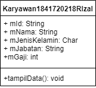
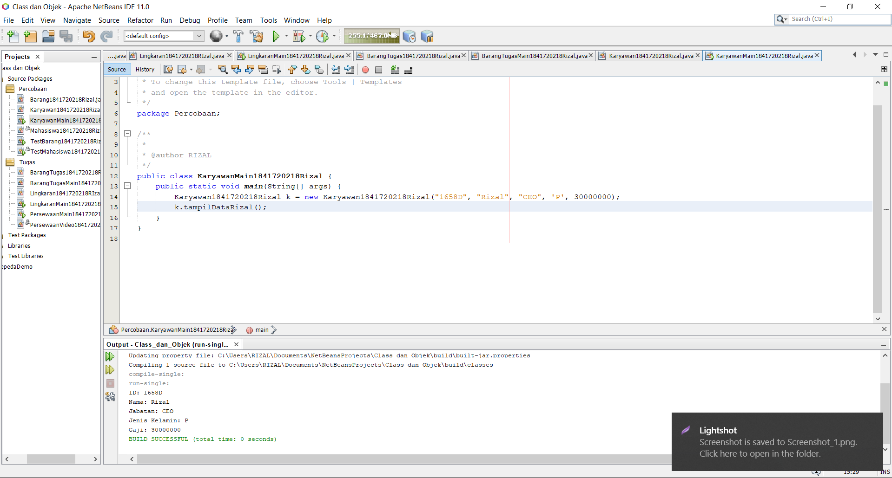
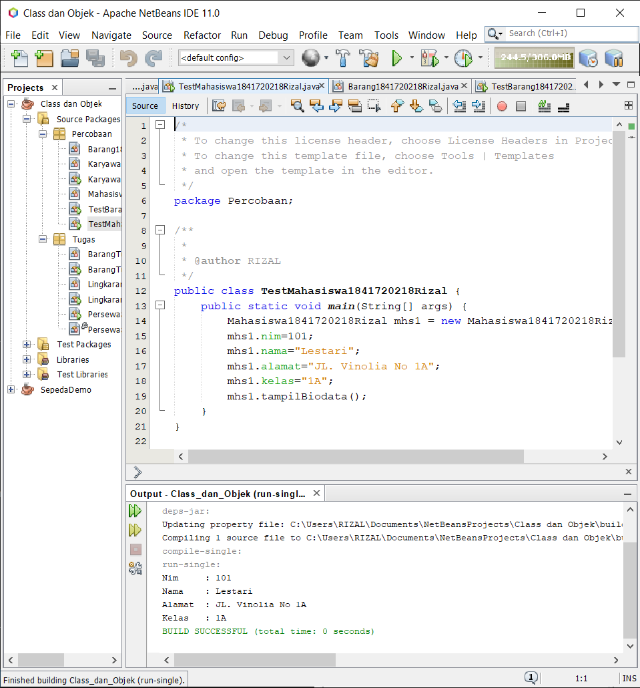
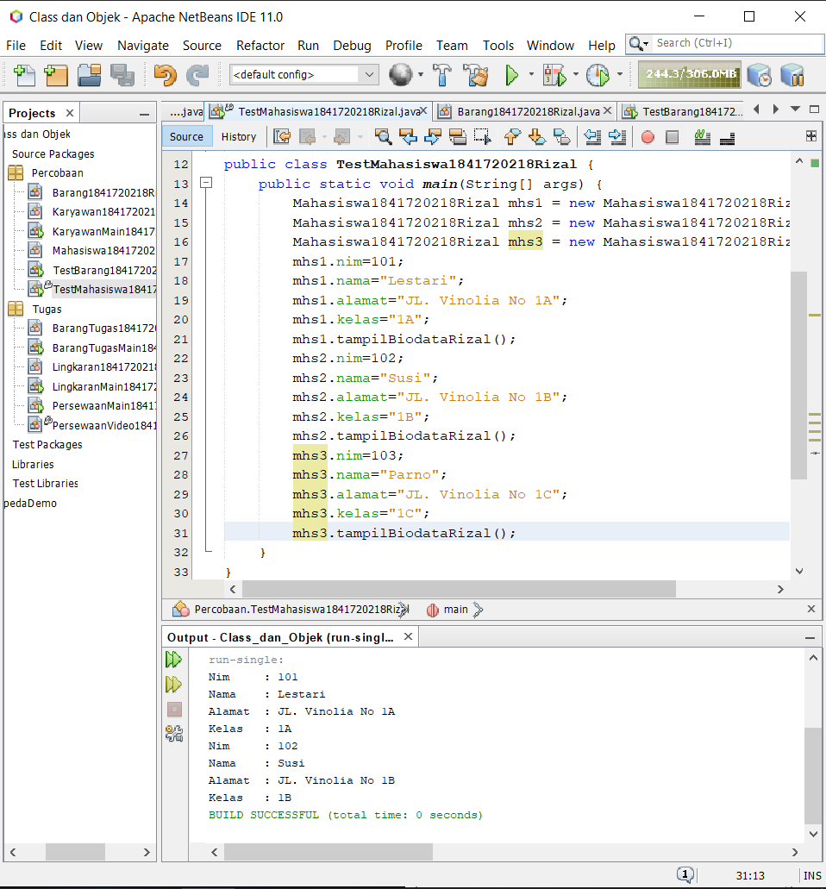
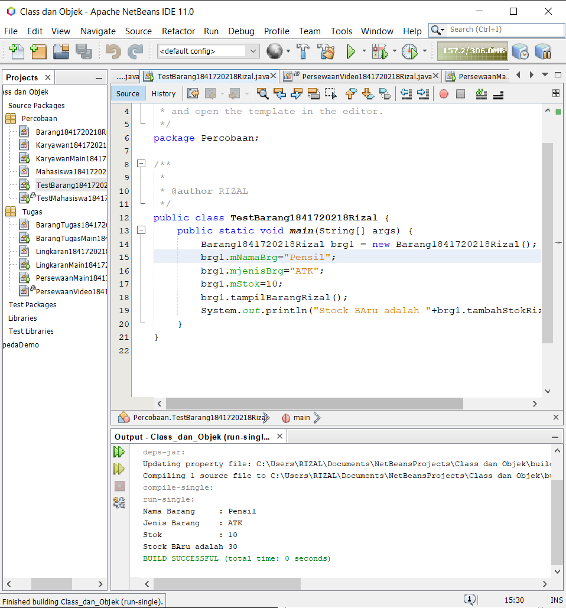
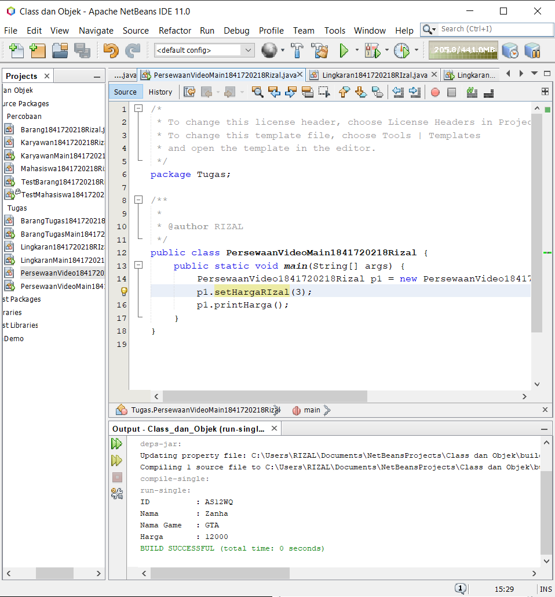
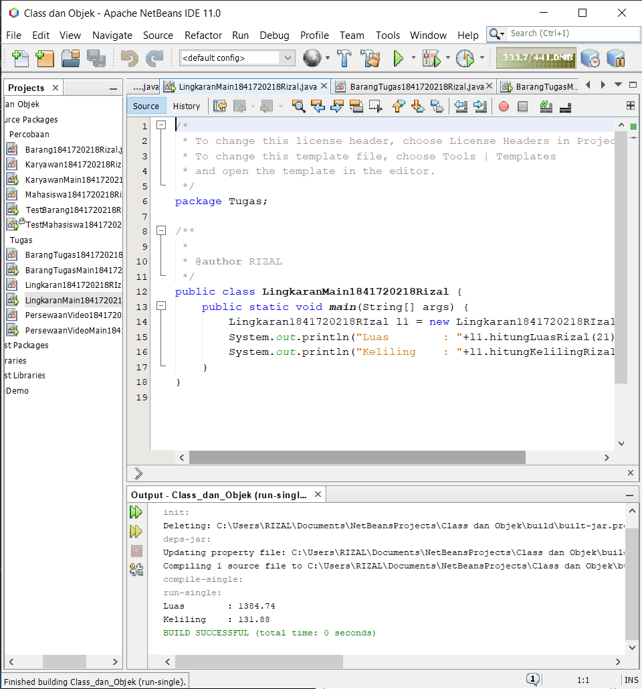
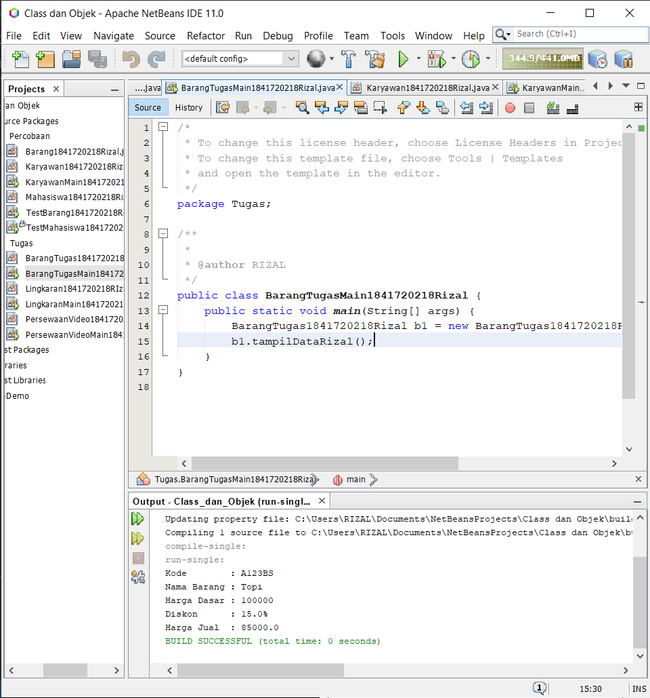

# Laporan Praktikum #2 - Class dan Object

## Kompetensi

* Mahasiswa dapat memahami deskripsi dari class dan object
* Mahasiswa memahami implementasi dari class
* Mahasiswa dapat memahami implementasi dari attribute
* Mahasiswa dapat memahami implementasi dari method
* Mahasiswa dapat memahami implementasi dari proses instansiasi
* Mahasiswa dapat memahami implementasi dari try-catch
* Mahasiswa dapat memahami proses pemodelan class diagram menggunakan UML

## Ringkasan Materi

* Perbedaan methode void dengan int.
* Deklarasi attribut dan method.
* Instansiasi objek.

## Percobaan

### Percobaan 1

Membuat Class Diagram

Dalam suatu perusahaan salah satu data yang diolah adalah data karyawan. Setiap karyawan memiliki id, nama, jenis kelamin, jabatan, jabatan, dan gaji. Setiap mahasiswa juga bisa menampilkan data diri pribadi dan melihat gajinya.

[kode program](../../src/2_Class_dan_Object/Percobaan/Karyawan1841720218Rizal.java)

### Percobaan 2

Membuat program berdasarkan class diagram Mahasiswa

[kode program](../../src/2_Class_dan_Object/Percobaan/Mahasiswa1841720218Rizal.java)

7. Jelaskan pada bagian mana proses pendeklarasian atribut pada program diatas!

        public int nim;
        public String nama;
        public String alamat;
        public String kelas;

8. Jelaskan pada bagian mana proses pendeklarasian method pada program diatas!

        public void tampilBiodata(){
            System.out.println("Nim     : "+nim);
            System.out.println("Nama    : "+nama);
            System.out.println("Alamat  : "+alamat);
            System.out.println("Kelas   : "+kelas);
        }

9. Berapa banyak objek yang di instansiasi pada program diatas!

        satu
        Mahasiswa1841720218Rizal mhs1 = new Mahasiswa1841720218Rizal();

10. Apakah yang sebenarnya dilakukan pada sintaks program “mhs1.nim=101” ?

        Objek memanggil atribut nim yang diisi dengan nilai 101

11. Apakah yang sebenarnya dilakukan pada sintaks program “mhs1.tampilBiodata()” ?

        Objek memanggil method tampilBiodataRizal()

12. Instansiasi 2 objek lagi pada program diatas!

[kode program](../../src/2_Class_dan_Object/Percobaan/TestMahasiswa1841720218Rizal.java)

### Percobaan3

Menulis method yang memiliki argument/parameter dan memiliki return

[kode program](../../src/2_Class_dan_Object/Percobaan/Barang1841720218Rizal.java)

7. Apakah fungsi argumen dalam suatu method?

        Untuk menentukan nilai atau merubah suatu nilai

8. Ambil kesimpulan tentang kegunaan dari kata kunci return , dan kapan suatu method harus memiliki return!

        return berfungsi untuk mengembalikan/mengeluarkan suatu nilai, 
        method dengan tipe data bukan void haru menggunakan return

## Tugas

### Tugas1

[kode program](../../src/2_Class_dan_Object/Tugas/PersewaanVideo1841720218Rizal.java)

[kode program main](../../src/2_Class_dan_Object/Tugas/PersewaanVideoMain1841720218Rizal.java)

### Tugas2

[kode program](../../src/2_Class_dan_Object/Tugas/Lingkaran1841720218Rizal.java)

[kode program main](../../src/2_Class_dan_Object/Tugas/LingkaranMain1841720218Rizal.java)

### Tugas3

[kode program](../../src/2_Class_dan_Object/Tugas/BarangTugas1841720218Rizal.java)

[kode program main](../../src/2_Class_dan_Object/Tugas/BarangTugasMain1841720218Rizal.java)

## Kesimpulan

* Memahami materi object
* Mengetahui nilai balik method
* Memahami materi Pemrograman Orientasi Objek

## Pernyataan Diri

Saya menyatakan isi tugas, kode program, dan laporan praktikum ini dibuat oleh saya sendiri. Saya tidak melakukan plagiasi, kecurangan, menyalin/menggandakan milik orang lain.

Jika saya melakukan plagiasi, kecurangan, atau melanggar hak kekayaan intelektual, saya siap untuk mendapat sanksi atau hukuman sesuai peraturan perundang-undangan yang berlaku.

Ttd,

***(Rizal Anhari)***