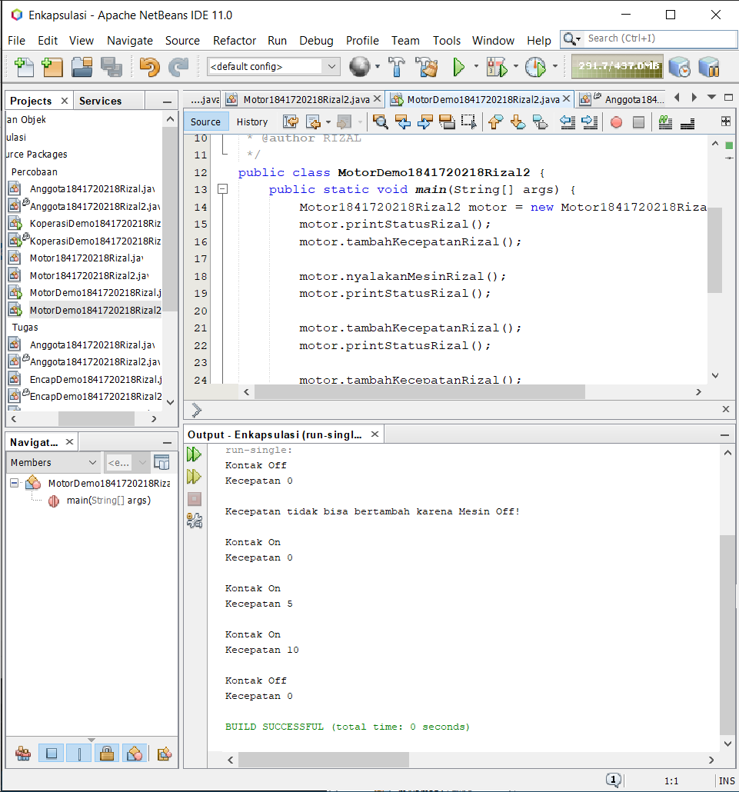

# Laporan Praktikum #3 - Enkapsulasi

## Kompetensi

Setelah melakukan percobaan pada modul ini, mahasiswa memahami konsep:

1. Konstruktor
2. Akses Modifier
3. Atribut/method pada class
4. Intansiasi atribut/method
5. Setter dan getter
6. Memahami notasi pada UML Class Diagram

## Ringkasan Materi


## Percobaan

### Percobaan 1

Membuat class Motor yang memiliki atribut kecepatan dan kontakOn, dan memiliki method printStatus() untuk menampilkan status motor.

bentuk UML class diagram class Motor adalah sebagai berikut:

`Diagram Class:`


`Screenshot:`


`Kode Program:`

* [Motor1841720218Rizal](../../src/3_Enkapsulasi/Percobaan/Motor1841720218Rizal.java)
* [MotorDemo1841720218Rizal](../../src/3_Enkapsulasi/Percobaan/MotorDemo1841720218Rizal.java)

Dari percobaan 1 - enkapsulasi, menurut anda, adakah yang janggal?

Yaitu, kecepatan motor tiba-tiba saja berubah dari 0 ke 50. Lebih janggal lagi, posisi kontak motor
masih dalam kondisi OFF. Bagaimana mungkin sebuah motor bisa sekejap berkecepatan dari nol ke
50, dan itupun kunci kontaknya OFF?

Nah dalam hal ini, akses ke atribut motor ternyata tidak terkontrol. Padahal, objek di dunia nyata selalu memiliki batasan dan mekanisme bagaimana objek tersebut dapat digunakan. Lalu, bagaimana kita bisa memperbaiki class Motor diatas agar dapat digunakan dengan baik? Kita bisa
pertimbangkan beberapa hal berikut ini:

1. Menyembunyikan atribut internal (kecepatan, kontakOn) dari pengguna (class lain)
2. Menyediakan method khusus untuk mengakses atribut.

### Percobaan 2

Pada percobaan ini akan digunakan access modifier untuk memperbaiki cara kerja class Motor pada
percobaan ke-1.

Ubah cara kerja class motor sesuai dengan UML class diagram berikut.

`Diagram Class:`


`Screenshot:`


`Kode Program:`

* [Motor1841720218Rizal2](../../src/3_Enkapsulasi/Percobaan/Motor1841720218Rizal2.java)
* [MotorDemo1841720218Rizal2](../../src/3_Enkapsulasi/Percobaan/MotorDemo1841720218Rizal2.java)

Dari percobaan diatas, dapat kita amati sekarang atribut kecepatan tidak bisa diakses oleh pengguna dan diganti nilainya secara sembarangan. Bahkan ketika mencoba menambah kecepatan saat posisi kontak masih OFF, maka akan muncul notifikasi bahwa mesin OFF. Untuk mendapatkan kecepatan Page 8 of 15
yang diinginkan, maka harus dilakukan secara gradual, yaitu dengan memanggil method tambahKecepatan() beberapa kali. Hal ini mirip seperti saat kita mengendarai motor.

### Pertanyaan Percobaan 2

1. Pada class TestMobil, saat kita menambah kecepatan untuk pertama kalinya, mengapa muncul peringatan “Kecepatan tidak bisa bertambah karena Mesin Off!”?

    `Jawab:`
    
    Karena pada method tambah kecepatan terdapat percabangan *if else* yang terdapat pengecekan kodisi, jika Jika **mKontakOn == true** maka kecepatan bertambah 5, tika tidak maka tidak dapat menambah kecepatan `jadi kecepatan tidak bisa bertambah karena sepeda belum nyala`

2. Mengapat atribut kecepatan dan kontakOn diset private?

    `Jawab:`

    Supaya atribut tersebut tidak bisa diakses oleh kelas lain

3. Ubah class Motor sehingga kecepatan maksimalnya adalah 100!
   
    `Jawab:`

```
    public void tambahKecepatanRizal(){
        if (mKontakOn==true) {
            if(mKecepatan<100){
                mKecepatan +=5;
                if(mKecepatan>100){
                    mKecepatan=100;
                }
            }
            else{
                System.out.println("Kecepatan tidak bisa bertambah");
            }
        }
        else{
            System.out.println("Kecepatan tidak bisa bertambah karena Mesin Off! \n");
        }
    }
```

### Percobaan 3

Misalkan di sebuah sistem informasi koperasi, terdapat class Anggota. Anggota memiliki atribut nama alamat dan simpanan, dan method setter, getter dan setor dan pinjam. Semua atribut pada anggota tidak boleh diubah sembarangan, melainkan hanya dapat diubah melalui method setter, getter, setor dan tarik. Khusus untuk atribut simpanan tidak terdapat setter karena simpanan akan bertambah ketika melakukan transaksi setor dan akan berkurang ketika melakukan peminjaman/tarik.

`Diagram Class:`


`Screenshot:`


`Kode Program:`

* [Anggota1841720218Rizal](../../src/3_Enkapsulasi/Percobaan/Anggota1841720218Rizal.java)
* [KoperasiDemo1841720218Rizal](../../src/3_Enkapsulasi/Percobaan/KoperasiDemo1841720218Rizal.java)

pada class [Anggota1841720218Rizal](../../src/3_Enkapsulasi/Percobaan/Anggota1841720218Rizal.java), atribut nama dan alamat memili masing-masing 1 getter dan setter. Sedangkan atribut simpanan hanya memiliki getSimpanan() saja, karena seperti tujuan awal, atribut simpanan akan berubah nilainya jika melakukan transaksi setor()dan pinjam/tarik().

Pada class [KoperasiDemo1841720218Rizal](../../src/3_Enkapsulasi/Percobaan/KoperasiDemo1841720218Rizal.java), untuk mengubah simpanan tidak dilakukan secara langsung dengan mengubah atribut simpanan, melainkan melalui method setor() dan pinjam(). Untuk menampilkan nama pun harus melalui method getNama(), dan untuk menampilkan simpanan melalui getSimpanan().

### Percobaan 4

`Screenshot:`


ketika dilakukan pemanggilan method **getNamaRizal()** hasilnya hal ini terjadi karena atribut nama belum diset nilai defaultnya. Hal ini dapat ditangani dengan membuat kontruktor.

`Kode Program:`

* [Anggota1841720218Rizal2](../../src/3_Enkapsulasi/Percobaan/Anggota1841720218Rizal2.java)
* [KoperasiDemo1841720218Rizal2](../../src/3_Enkapsulasi/Percobaan/KoperasiDemo1841720218Rizal2.java)

Pada class Anggota dibuat kontruktor dengan access modifier default yang memiliki 2 parameter nama dan alamat. Dan didalam konstruktor tersebut dipastikan nilai simpanan untuk pertama kali adalah Rp. 0.

Setelah menambah konstruktor pada class Anggoata maka atribut nama dan alamat secara otomatis harus diset terlebih dahulu dengan melakukan passing parameter jika melakukan instansiasi class Anggota. Hal ini biasa dilakukan untuk atribut yang membutuhkan nilai yang spesifik. Jika tidak membutuhkan nilai spesifik dalam konstruktor tidak perlu parameter. Contohnya simpanan untuk anggota baru diset 0, maka simpanan tidak perlu untuk dijadikan parameter pada konstruktor.

### Pertanyaan Percobaan 3 dan 4

1. Apa yang dimaksud getter dan setter?

   `Jawaban:`

    Method **setter** tidak nilai kembalian *void* karena berfungsi untuk memasukan atau memanipulasi nilai dari atribut private

    Method **getter** memiliki nilai kembalian (*return*) sesuai dengan tipe data yang akan diambil dari atribut private

2. Apa kegunaan dari method getSimpananRizal()?

   `Jawaban:`

    Method **getSimpananRizal()** berfungsi untuk menampilkan nilai dari variabel mSimpanan
    

3. Method apa yang digunakan untk menambah saldo?

    `Jawaban:`

    **setorRizal()**

4. Apa yand dimaksud konstruktor?

    `Jawaban:`

    Method khusus yang akan dieksekusi pada saat pembuatan objek (*instance*). konstruktor tidak memiliki memiliki tipe *return*

5. Sebutkan aturan dalam membuat konstruktor?

    `Jawaban:`

    1. Nama konstruktor harus sama dengan nama class
    2. Konstruktor tidak memiliki tipe data return
    3. Konstruktor tidak boleh menggunakan modifier abstract, static, final, dan syncronized

6. Apakah boleh konstruktor bertipe private?

   `Jawaban:`

    Konstruktor pada java boleh memiliki tipe private,protected, public or default.

7. Kapan menggunakan parameter dengan passsing parameter?

    `Jawaban:`

    Setelah menambah konstruktor pada class Anggota maka Atribut nama dan alamat secara otomatis harus diset terlebih dahulu dengan melakukan passing parameter jika melakukan instansiasi class Anggota.

8. Apa perbedaan atribut class dan instansiasi atribut?

    `Jawaban:`

    * Atribut class adalah suatu nilai data yang terdapat pada suatu objek yang berasal dari class
    * instansiasi atribut adalah variabel yang didefinisikan di dalam suatu metod dan hanya menjadi milik dari instance kelas

9.  Apa perbedaan class method dan instansiasi method?

    `Jawaban:`

    * class method 
      * method dimiliki oleh Class
      * method class dideklarasikan menggunakan kata kunci static.
    * instansiasi method
      * Atribut yang dimiliki oleh objek hasil instansiasi
      * Untuk akses, method sebelumnya harus membuat objek terlebih dahulu.

## Tugas

1. Cobalah program dibawah ini dan tuliskan hasil outputnya

    `Soal:`
    

    `Screenshot:`
    

    `Kode Program:`

   * [EncapDemo1841720218Rizal](../../src/3_Enkapsulasi/Tugas/EncapDemo1841720218Rizal.java)
   * [EncapTest1841720218Rizal](../../src/3_Enkapsulasi/Tugas/EncapTest1841720218Rizal.java)

2. Pada program diatas, pada class EncapTest kita mengeset age dengan nilai 35, namun pada saat ditampilkan ke layar nilainya 30, jelaskan mengapa.

    `Jawaban:`

    Karena pada method **setAgeRizal()** tedapat percabangan yang melakukan pengecekan kondisi. Jika parameter *newAge* disi dengan nilai yang lebuh besar dari 30 maka *mAge* akan diisi dengan nilai 30

3. Ubah program diatas agar atribut age dapat diberi nilai maksimal 30 dan minimal 18.
   
    `Jawaban:`

    [EncapDemo1841720218Rizal2](../../src/3_Enkapsulasi/Tugas/EncapDemo1841720218Rizal2.java)

```
    public void setAgeRizal(int newAge){
        if (newAge>30) {
            mAge=30;
        }
        else if(newAge<18){
            mAge=18;
        }
        else{
            mAge=newAge;
        }
    }
```

4. Pada sebuah sistem informasi koperasi simpan pinjam, terdapat class Anggota yang memiliki atribut antara lain nomor KTP, nama, limit peminjaman, dan jumlah pinjaman. Anggota dapat meminjam uang dengan batas limit peminjaman yang ditentukan. Anggota juga dapat mengangsur pinjaman. Ketika Anggota tersebut mengangsur pinjaman, maka jumlah pinjaman akan berkurang sesuai dengan nominal yang diangsur. Buatlah class Anggota tersebut, berikan atribut, method dan konstruktor sesuai dengan kebutuhan. Uji dengan TestKoperasi berikut ini untuk memeriksa apakah class Anggota yang anda buat telah sesuai dengan yang diharapkan.

    `Soal:`
    
    

    `Jawaban:`

    `Screenshot:`

    
    
    `Kode Program:`

    * [Anggota1841720218Rizal](../../src/3_Enkapsulasi/Tugas/Anggota1841720218Rizal.java)
    * [TestKoperasi1841720218Rizal](../../src/3_Enkapsulasi/Tugas/TestKoperasi1841720218Rizal.java)

5. Modifikasi soal no. 4 agar nominal yang dapat diangsur minimal adalah 10% dari jumlah pinjaman saat ini. Jika mengangsur kurang dari itu, maka muncul peringatan “Maaf, angsuran harus 10% dari jumlah pinjaman”.
   
    `Jawaban:`

    [Anggota1841720218Rizal2](../../src/3_Enkapsulasi/Tugas/Anggota1841720218Rizal2.java)

```
    public void angsurRizal(int newAngsuran){
        if (newAngsuran<mJumlahPinjaman*10/100) {
            System.out.println("Maaf angsuran harus 10% dari jumlah pinjaman");
            newAngsuran=0;
        }
        mJumlahPinjaman -= newAngsuran;
    }
```

6. Modifikasi class TestKoperasi, agar jumlah pinjaman dan angsuran dapat menerima input dari console.

    `Jawaban:`

    

    `Kode Program:`

    * [Anggota1841720218Rizal2](../../src/3_Enkapsulasi/Tugas/Anggota1841720218Rizal2.java)
    * [TestKoperasi1841720218Rizal2](../../src/3_Enkapsulasi/Tugas/TestKoperasi1841720218Rizal2.java)

## Kesimpulan

Dari percobaan diatas, telah dipelajari kosep dari enkapsulasi kontruktor, access modifier yang terdiri dari 4 jenis yaitu public, protected, default dan private. Konsep atribut atau method class yang ada di dalam blok code class dan konsep instansiasi atribut atau method. Cara penggunaan getter dan setter beserta fungsi dari getter dan setter. Dan juga telah dipelajari atau memahami notasi UML

## Pernyataan Diri

Saya menyatakan isi tugas, kode program, dan laporan praktikum ini dibuat oleh saya sendiri. Saya tidak melakukan plagiasi, kecurangan, menyalin/menggandakan milik orang lain.

Jika saya melakukan plagiasi, kecurangan, atau melanggar hak kekayaan intelektual, saya siap untuk mendapat sanksi atau hukuman sesuai peraturan perundang-undangan yang berlaku.

Ttd,

***Rizal Anhari***