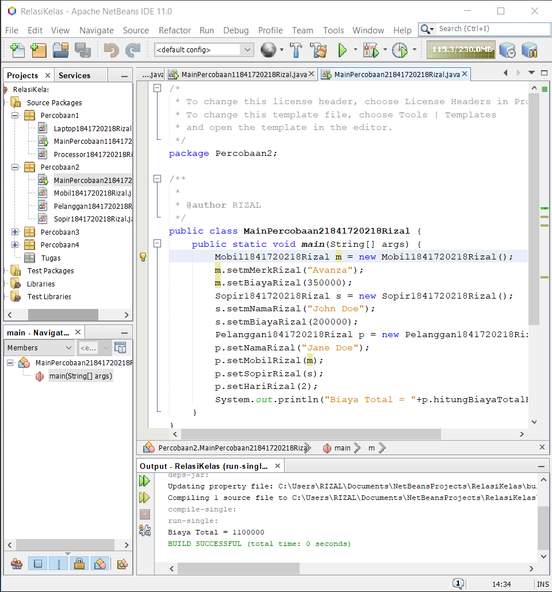

# Laporan Praktikum #4 - Relasi Kelas

## Kompetensi

Setelah menempuh pokok bahasan ini, mahasiswa mampu:

1. Memahami konsep relasi kelas;
2. Mengimplementasikan relasi has‑a dalam program.

## Ringkasan Materi

1. Relasiclass

2. Multiplicity

## Percobaan

### Percobaan 1

Perhatikan diagram class berikut:


`Screenshot:`


`Kode Program:`

* [Laptop1841720218Rizal](../../src/4_Relasi_Class/Percobaan1/Laptop1841720218Rizal.java)

* [Processor1841720218Rizal](../../src/4_Relasi_Class/Percobaan1/Processor1841720218Rizal.java)

* [MainPercobaan11841720218Rizal](../../src/4_Relasi_Class/Percobaan1/MainPercobaan11841720218Rizal.java)

`pertanyaan`

1. Di dalam class Processor dan class Laptop , terdapat method setter dan getter untuk masing‑masing atributnya. Apakah gunanya method setter dan getter tersebut ?

2. Di dalam class Processor dan class Laptop, masing‑masing terdapat konstruktor default dan konstruktor berparameter. Bagaimanakah beda penggunaan dari kedua jenis konstruktor tersebut ?

3. Perhatikan class Laptop, di antara 2 atribut yang dimiliki (merk dan proc), atribut manakah yang bertipe object ?

4. Perhatikan class Laptop, pada baris manakah yang menunjukan bahwa class Laptop memiliki relasi dengan class Processor ?

5. Perhatikan pada class Laptop , Apakah guna dari sintaks proc.info() ?

6. Pada class MainPercobaan1, terdapat baris kode:
```Laptop l = new Laptop("Thinkpad", p);```
Apakah p tersebut ?
Dan apakah yang terjadi jika baris kode tersebut diubah menjadi:
```Laptop l = new Laptop("Thinkpad", new Processor "Intel i5", 3));```
Bagaimanakah hasil program saat dijalankan, apakah ada perubahan ?

`Jawab`

1. **setter** digunakan untuk memberikan set nilai untuk suatu properti, **getter** melakukan penyembunyian ketika kita memproteksi properti dan method yang ada pada class dengan keyword visibilitas Privite ataupun protected

2. Default konstruktor adalah jenis konstruktor yang disebut secara otomatis ketika programmer belum mendefinisikan konstruktor dalam program. Sebaliknya, konstruktor berparameter adalah jenis konstruktor yang ditentukan oleh pemrogram dengan melewatkan parameter untuk memberikan nilai awal pada variabel instan di kelas

3. proc yang merupakan objek dari **Processor1841720218Rizal**

4. 
        private Processor1841720218Rizal mProc;

        public Laptop1841720218Rizal(String merk,Processor1841720218Rizal proc)

        public Processor1841720218Rizal getmProcRizal()

        public void setmProcRizal(Processor1841720218Rizal mProc)

5. memanggil method info dari class Processor1841720218Rizal

6. * p adalah objek dari class Processor1841720218Rizal
   * sama

### Percobaan 2

Perhatikan diagram class berikut:


`Screenshot:`



`Kode Program:`

* [MainPercobaan21841720218Rizal](../../src/4_Relasi_Class/Percobaan2/MainPercobaan21841720218Rizal.java)

* [Mobil1841720218Rizal](../../src/4_Relasi_Class/Percobaan2/Mobil1841720218Rizal.java)

* [Pelanggan1841720218Rizal](../../src/4_Relasi_Class/Percobaan2/Pelanggan1841720218Rizal.java)

* [Sopir1841720218Rizal](../../src/4_Relasi_Class/Percobaan2/Sopir1841720218Rizal.java)

`pertanyaan`

1. Perhatikan class Pelanggan. Pada baris program manakah yang menunjukan bahwa class Pelanggan memiliki relasi dengan class Mobil dan class Sopir ?

2. Perhatikan method hitungBiayaSopir pada class Sopir, serta method hitungBiayaMobil pada class Mobil. Mengapa menurut Anda method tersebut harus memiliki argument hari ?

3. Perhatikan kode dari class Pelanggan. Untuk apakah perintah mobil.hitungBiayaMobil(hari) dan sopir.hitungBiayaSopir(hari) ?

4. Perhatikan class MainPercobaan2. Untuk apakah sintaks p.setMobil(m) dan p.setSopir(s) ?

5. Perhatikan class MainPercobaan2. Untuk apakah proses p.hitungBiayaTotal() tersebut ?

6. Perhatikan class MainPercobaan2, coba tambahkan pada baris terakhir dari method main dan amati perubahan saat di‑run!
System.out.println(p.getMobil().getMerk());
Jadi untuk apakah sintaks p.getMobil().getMerk() yang ada di dalam method
main tersebut?

`Jawab`

1. 
        private Mobil1841720218Rizal mobil;
        private Sopir1841720218Rizal sopir;

2. karena biaya sewa dihitung per hari

3. untuk menghitung biaya total

4. untuk menjalankan method setmobil dan setsopir dengan parameter m dan s

5. untuk menghitung biaya total pada class pelanggan

6. digunakan untuk menampilkan merek mobil

### Percobaan 3

Perhatikan diagram class berikut:


`Screenshot:`


`Kode Program:`

* [KeretaApi1841720218Rizal](../../src/4_Relasi_Class/Percobaan3/KeretaApi1841720218Rizal.java)

* [MainPercobaan31841720218Rizal](../../src/4_Relasi_Class/Percobaan3/MainPercobaan31841720218Rizal.java)

* [Pegawai1841720218Rizal](../../src/4_Relasi_Class/Percobaan3/Pegawai1841720218Rizal.java)

`pertanyaan`

1. Di dalam method info() pada class KeretaApi, baris this.masinis.info() dan this.asisten.info() digunakan untuk apa ?

2. Buatlah main program baru dengan nama class MainPertanyaan pada package yang sama. Tambahkan kode berikut pada method main() ! 

        Pegawai masinis = new Pegawai("1234", "Spongebob Squarepants"); 
        KeretaApi keretaApi = new KeretaApi("Gaya Baru", "Bisnis", masinis); 
        System.out.println(keretaApi.info());

3. Apa hasil output dari main program tersebut ? Mengapa hal tersebut dapat terjadi ?
4. Perbaiki class KeretaApi sehingga program dapat berjalan !

`Jawab`

1. untuk menampilkan ifo masinis dan info asisten

2. [MainPertanyaan1841720218Rizal](../../src/4_Relasi_Class/Percobaan3/MainPertanyaan1841720218Rizal.java)

3. Hasilnya error, karena atribut asisten pada methode info tidak dideklarasikan. senhingga program error.

### Percobaan 4

Perhatikan diagram class berikut:


`Screenshot:`


`Kode Program:`

* [Gerbong1841720218Rizal](../../src/4_Relasi_Class/Percobaan4/Gerbong1841720218Rizal.java)

* [Kursi1841720218Rizal](../../src/4_Relasi_Class/Percobaan4/Kursi1841720218Rizal.java)

* [MainPercobaan41841720218Rizal](../../src/4_Relasi_Class/Percobaan4/MainPercobaan41841720218Rizal.java)

* [Penumpang1841720218Rizal](../../src/4_Relasi_Class/Percobaan4/Penumpang1841720218Rizal.java)

`pertanyaan`

1. Pada main program dalam class MainPercobaan4, berapakah jumlah kursi dalam Gerbong A ?

2. Perhatikan potongan kode pada method info() dalam class Kursi. Apa maksud kode tersebut ?

```
...
if (this.penumpang != null) {
info += "Penumpang: " + penumpang.info() + "\n";
}
...
```

3. Mengapa pada method setPenumpang() dalam class Gerbong, nilai nomor dikurangi dengan angka 1 ?

4. Instansiasi objek baru budi dengan tipe Penumpang, kemudian masukkan objek baru tersebut pada gerbong dengan gerbong.setPenumpang(budi, 1). Apakah yang terjadi ?

5. Modifikasi program sehingga tidak diperkenankan untuk menduduki kursi yang sudah ada penumpang lain !

`Jawab`

1. 10, 2-10 kosong

2. Jika terdapat penumpang maka mathod info ditambahkan data penumpang

3. karena looping dimulai dari 0-9

4. kursi 1 akan di ganti dengan budi

5. 
``` 
   public void setPenumpangRizal(Penumpang1841720218Rizal penumpang, int nomor) {
        if (this.mArrayKursi[nomor - 1].getmPenumpangRizal() == null) {
            this.mArrayKursi[nomor - 1].setmPenumpangRizal(penumpang);
        } else {
            System.out.println("Kursi Nomor: "+nomor+" Sudah Ditempati");
            
        }

    }
```

## Tugas

Buatlah sebuah studi kasus, rancang dengan class diagram, kemudian implementasikan ke dalam program! Studi kasus harus mewakili relasi class dari percobaan‑percobaan yang telah dilakukan pada materi ini, setidaknya melibatkan minimal 4 class (class yang berisi main tidak dihitung).

`Screenshot:`


`Kode Program:`

* [Baju1841720218Rizal](../../src/4_Relasi_Class/Tugas/Baju1841720218Rizal.java)

* [Celana1841720218Rizal](../../src/4_Relasi_Class/Tugas/Celana1841720218Rizal.java)

* [MainTugas1841720218Rizal](../../src/4_Relasi_Class/Tugas/MainTugas1841720218Rizal.java)

* [Pembeli1841720218Rizal](../../src/4_Relasi_Class/Tugas/Pembeli1841720218Rizal.java)

* [Toko1841720218Rizal](../../src/4_Relasi_Class/Tugas/Toko1841720218Rizal.java)

## Kesimpulan

* Memahami konsep relasi kelas;
* Mengimplementasikan relasi has‑a dalam program.

## Pernyataan Diri

Saya menyatakan isi tugas, kode program, dan laporan praktikum ini dibuat oleh saya sendiri. Saya tidak melakukan plagiasi, kecurangan, menyalin/menggandakan milik orang lain.

Jika saya melakukan plagiasi, kecurangan, atau melanggar hak kekayaan intelektual, saya siap untuk mendapat sanksi atau hukuman sesuai peraturan perundang-undangan yang berlaku.

Ttd,

***Rizal Anhari***