# Laporan Praktikum #4 - Relasi Kelas

## Kompetensi

1. Memahami konsep dasar inheritance atau pewarisan.
2. Mampu membuat suatu subclass dari suatu superclass tertentu.
3. Mampu mengimplementasikan konsep single dan multilevel inheritance.
4. Mampu membuat objek dari suatu subclass dan melakukan pengaksesan terhadap atribut dan method baik yang dimiliki sendiri atau turunan dari superclass nya.


## Ringkasan Materi

Inheritance atau pewarisan sifat merupakan suatu cara untuk menurunkan suatu class yang lebih umum menjadi suatu class yang lebih spesifik. Inheritance adalah salah satu ciri utama suatu bahasa program yang berorientasi pada objek. Inti dari pewarisan adalah sifat reusable dari konsep object oriented. Setiap subclass akan “mewarisi” sifat dari superclass selama bersifat protected ataupun public.

* Ciri-ciri
    * super.namaAtribut
    * super.namaMethod()
    * super()
    * super(parameter1, parameter2,dst)


## Percobaan

### Percobaan 1

`Screenshot:`

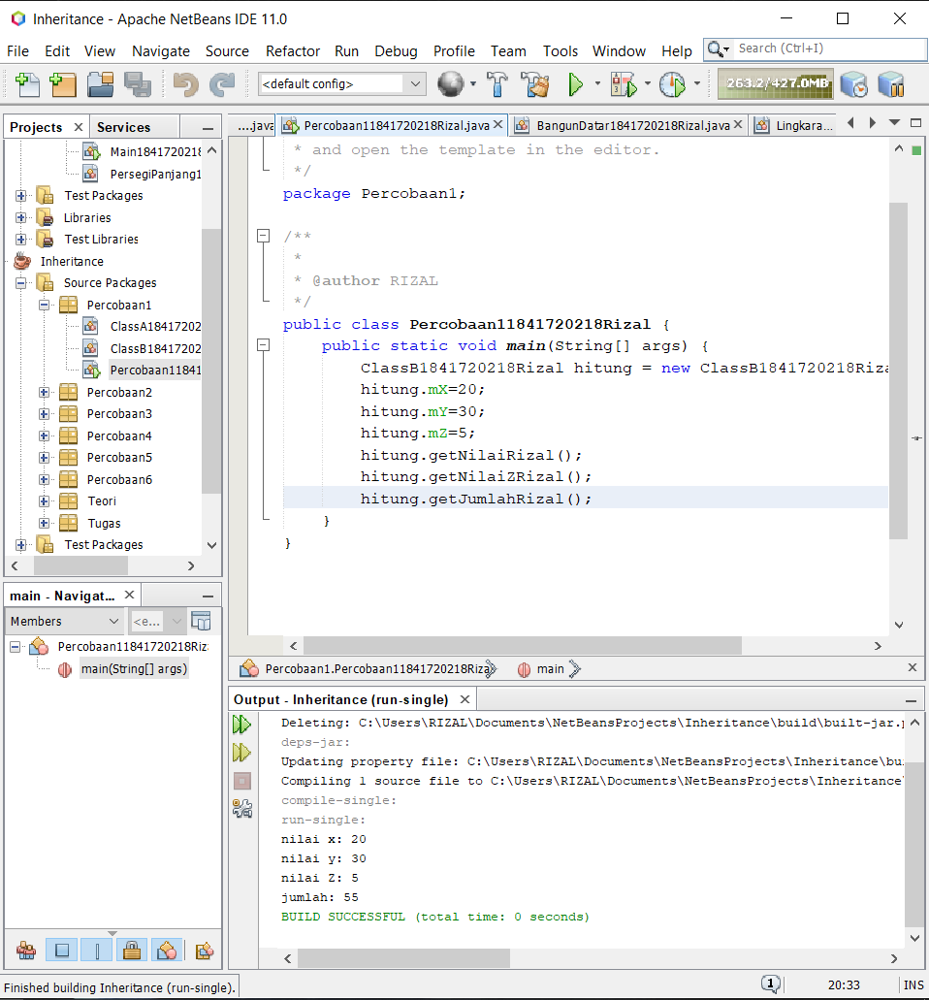

`Kode Program:`

* [ClassA1841720218Rizal](../../src/6_inheritance/Percobaan1/ClassA1841720218Rizal.java)

* [ClassB1841720218Rizal](../../src/6_inheritance/Percobaan1/ClassB1841720218Rizal.java)

* [Percobaan11841720218Rizal](../../src/6_inheritance/Percobaan1/Percobaan11841720218Rizal.java)

`pertanyaan`

1. Pada percobaan 1 diatas program yang dijalankan terjadi error, kemudian perbaiki sehingga program tersebut bisa dijalankan dan tidak error!
   
    `jawab`

    ```public class ClassB1841720218Rizal extends ClassA1841720218Rizal{```

2. Jelaskan apa penyebab program pada percobaan 1 ketika dijalankan terdapat error!

    `jawab`

    karena pada ClassB1841720218Rizal terdapat pemanggilan atribut ClassA1841720218Rizal senhingga ClassA1841720218Rizal harus mewariskan atributnya (**extends**)

### Percobaan 2

`Screenshot:`

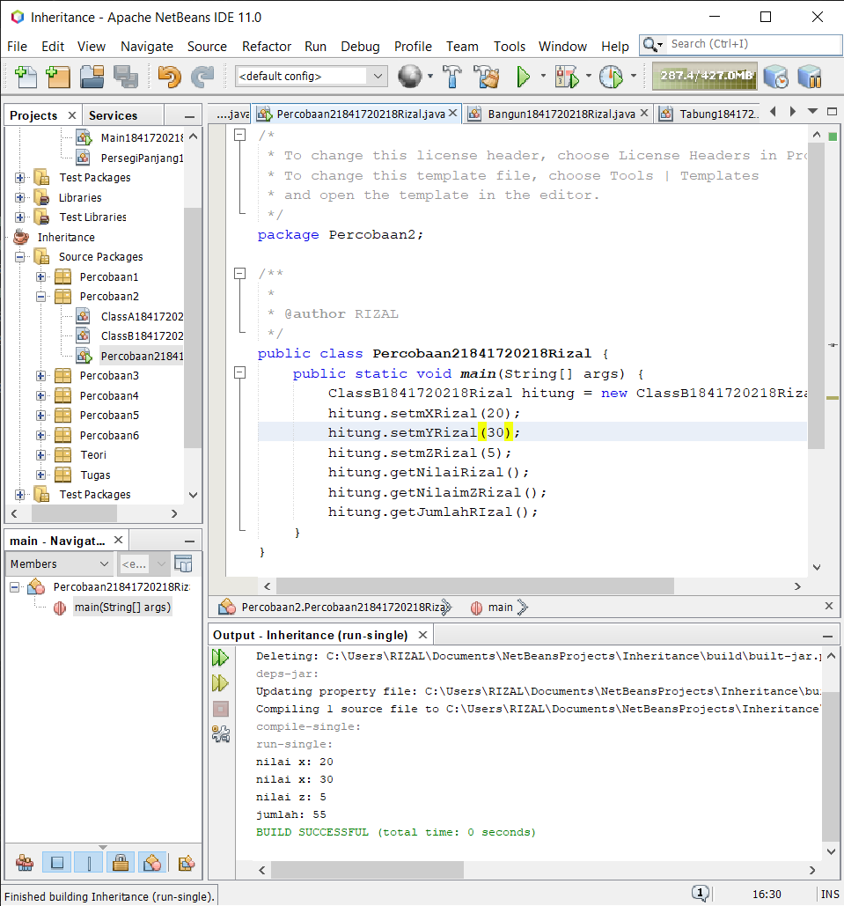

`Kode Program:`

* [ClassA1841720218Rizal](../../src/6_inheritance/Percobaan2/ClassA1841720218Rizal.java)

* [ClassB1841720218Rizal](../../src/6_inheritance/Percobaan2/ClassB1841720218Rizal.java)

* [Percobaan21841720218Rizal](../../src/6_inheritance/Percobaan2/Percobaan21841720218Rizal.java)

`pertanyaan`

1. Pada percobaan 2 diatas program yang dijalankan terjadi error, kemudian perbaiki sehingga program tersebut bisa dijalankan dan tidak error!

    `jawab`

    ```protected int mX; protected int mY;```

2. Jelaskan apa penyebab program pada percobaan 1 ketika dijalankan terdapat error!

    `jawab`

    Karena pada ClassA1841720218RIzal atributnya ber-modifier private sehingga tidak dapat diakses oleh class lain

### Percobaan 3

`Screenshot:`

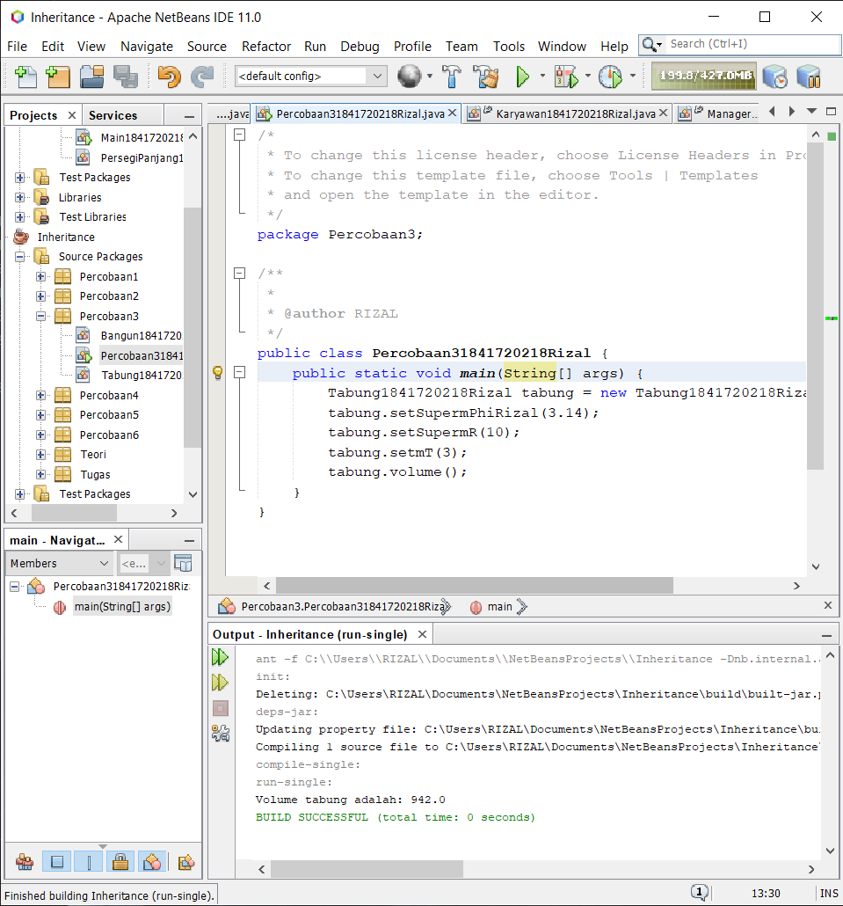

`Kode Program:`

* [Bangun1841720218Rizal](../../src/6_inheritance/Percobaan3/Bangun1841720218Rizal.java)

* [Tabung1841720218Rizal](../../src/6_inheritance/Percobaan3/Tabung1841720218Rizal.java)

* [Percobaan31841720218Rizal](../../src/6_inheritance/Percobaan3/Percobaan31841720218Rizal.java)

`pertanyaan`

1. Jelaskan fungsi “super” pada potongan program berikut di class Tabung!

    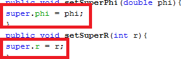

    `jawab`

    **super.namaatribut** berfungsi untuk memanggil atribut pada class parent. selanjutnya akan di set sesuai dengan method tersebut

2. Jelaskan fungsi “super” dan “this” pada potongan program berikut di class Tabung!

    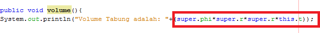

    `jawab`

    **super.namaatribut** digunakan untuk memanggil atribut parent sedangkan **this.namaatribut** di gunakan untuk memanggil atribut class nya sendiri

3. Jelaskan mengapa pada class Tabung tidak dideklarasikan atribut “phi” dan “r” tetapi class tersebut dapat mengakses atribut tersebut!
   
    `jawab`

    karena atribut phi dan r sudah terdapat pada class parent sehingga class tabung hanya memanggil atribut parent 

### Percobaan 4

`Screenshot:`

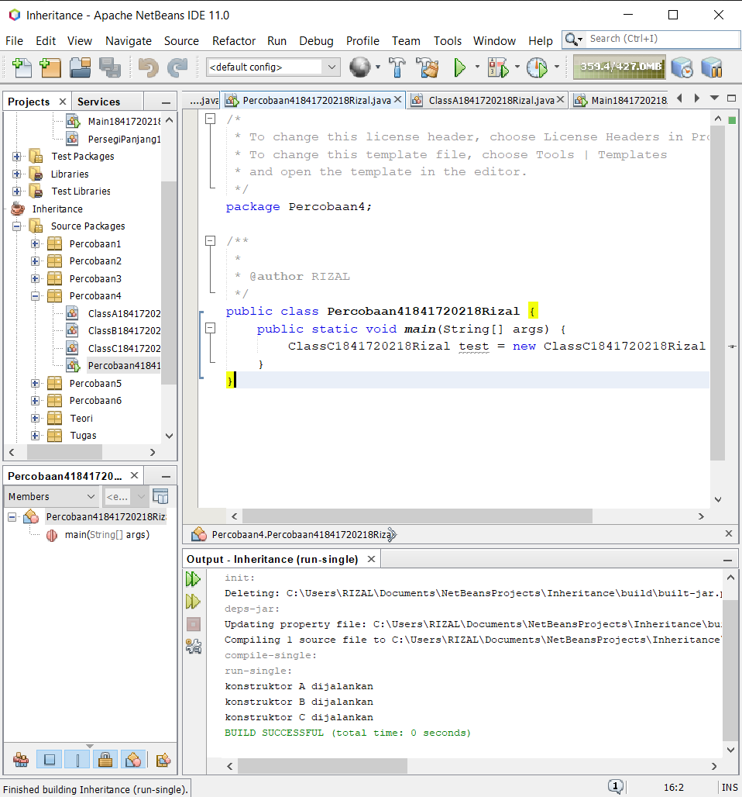

`Kode Program:`

* [ClassA1841720218Rizal](../../src/6_inheritance/Percobaan4/ClassA1841720218Rizal.java)

* [ClassB1841720218Rizal](../../src/6_inheritance/Percobaan4/ClassB1841720218Rizal.java)

* [ClassC1841720218Rizal](../../src/6_inheritance/Percobaan4/ClassC1841720218Rizal.java)

* [Percobaan41841720218Rizal](../../src/6_inheritance/Percobaan4/Percobaan41841720218Rizal.java)

`pertanyaan`

1. Pada percobaan 4 sebutkan mana class yang termasuk superclass dan subclass, kemudian jelaskan alasannya!
   
    `jawab`

    * superclass: ClassA1841720218Rizal
    * subclass: ClassB1841720218Rizal, ClassC1841720218Rizal

    karena karena classB mewarisi classA (**extends classA**) dan classC mewarisi classB (**extend classB**)

2. Ubahlah isi konstruktor default ClassC seperti berikut:

    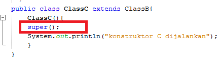

3. Ublah isi konstruktor default ClassC seperti berikut:

    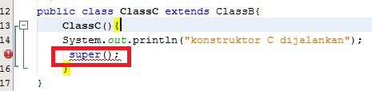

    Ketika mengubah posisi super() dibaris kedua dalam kontruktor defaultnya dan terlihat ada error. Kemudian kembalikan super() kebaris pertama seperti sebelumnya, maka errornya akan hilang.

    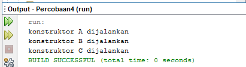
    
    Perhatikan hasil keluaran ketika class Percobaan4 dijalankan. Kenapa bisa tampil output seperti berikut pada saat instansiasi objek test dari class ClassC

    Jelaskan bagaimana urutan proses jalannya konstruktor saat objek test dibuat!

    `jawab`

    urutan berjalannya contructor yaitu contructor parent akan dijalankan pertama lalu constructor subclass dijalankan secara urut sesuai tingkatnya

4. Apakah fungsi super() pada potongan program dibawah ini di ClassC!

    

    `jawab`

    Merujuk / memanggil konstruktor parent class /superclass 

### Percobaan 5

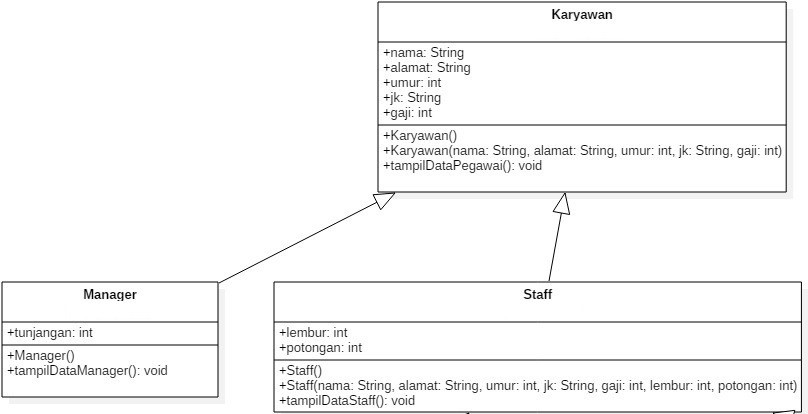

`Screenshot:`

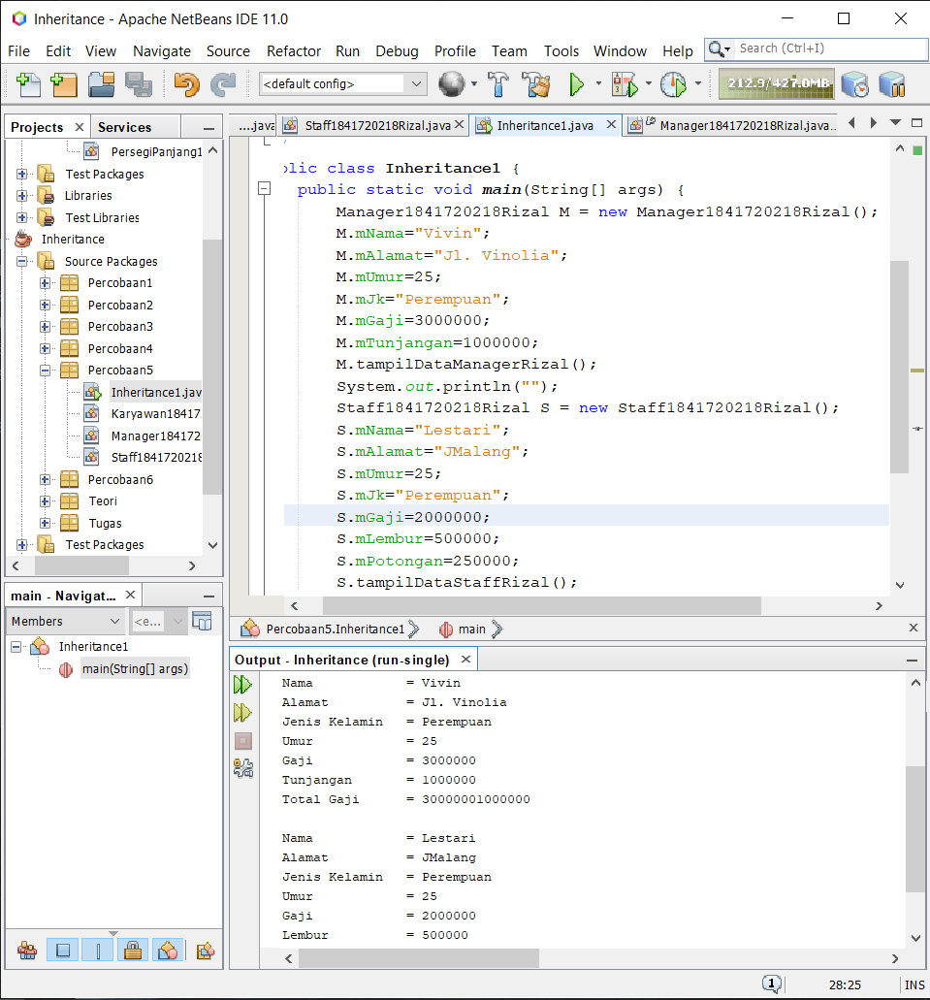

`Kode Program:`

* [Karyawan1841720218Rizal](../../src/6_inheritance/Percobaan5/Karyawan1841720218Rizal.java)

* [Manager1841720218Rizal](../../src/6_inheritance/Percobaan5/Manager1841720218Rizal.java)

* [Staff1841720218Rizal](../../src/6_inheritance/Percobaan5/Staff1841720218Rizal.java)

* [Inheritance11841720218Rizal](../../src/6_inheritance/Percobaan5/Inheritance11841720218Rizal.java)

`pertanyaan`

1. Sebutkan class mana yang termasuk super class dan sub class dari percobaan 1 diatas!

    `jawab`

    * superclass: Karyawan1841720218Rizal
    * subclass: Manager1841720218Rizal, Staff1841720218Rizal

2. Kata kunci apakah yang digunakan untuk menurunkan suatu class ke class yang lain?

    `jawab`

    **extends**

3. Perhatikan kode program pada class Manager, atribut apa saja yang dimiliki oleh class tersebut? Sebutkan atribut mana saja yang diwarisi dari class Karyawan!

    `jawab`

    * atribut classManager: mTunjangan
    * atribut classSuper: mGaji

4. Jelaskan kata kunci super pada potongan program dibawah ini yang terdapat pada class Manager!

    

    `jawab`

    karena digunaan untuk memanggil atribut parent classManager yaitu atribut classKaryawan

5. Program pada percobaan 1 diatas termasuk dalam jenis inheritance apa? Jelaskan alasannya!

    `jawab`

    single inheritance karena class Manager, Staff hanya mewarisi class Karyawan dan tidak terdapat sub subclass

### Percobaan 6

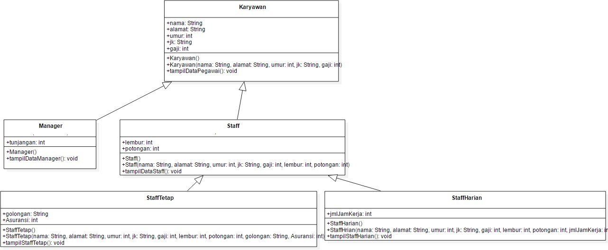

`Screenshot:`

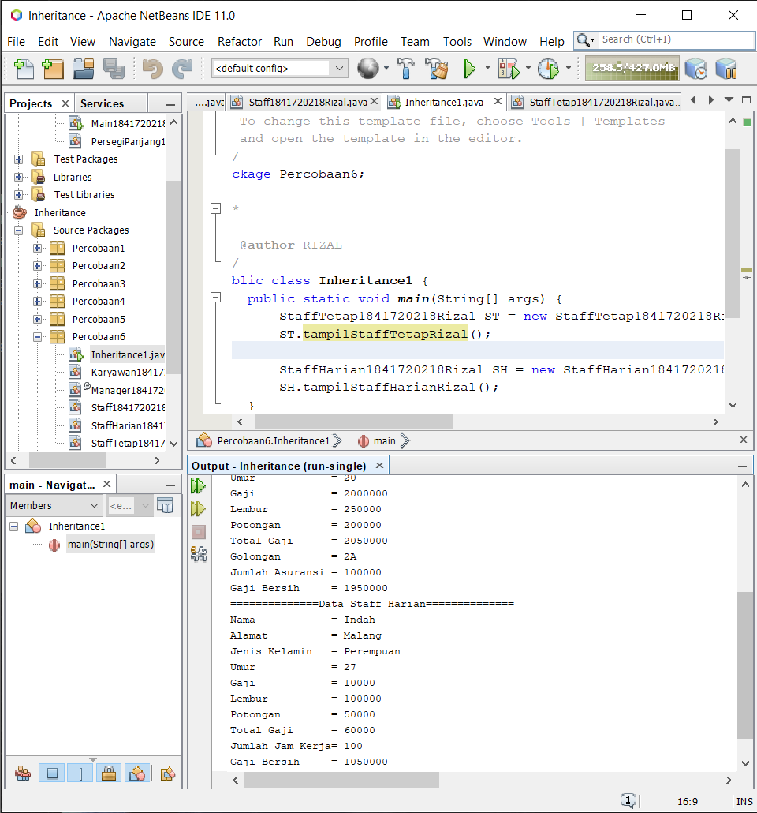

`Kode Program:`

* [Karyawan1841720218Rizal](../../src/6_inheritance/Percobaan6/Karyawan1841720218Rizal.java)

* [Manager1841720218Rizal](../../src/6_inheritance/Percobaan6/Manager1841720218Rizal.java)

* [Staff1841720218Rizal](../../src/6_inheritance/Percobaan6/Staff1841720218Rizal.java)

* [StaffHarian1841720218Rizal](../../src/6_inheritance/Percobaan6/StaffHarian1841720218Rizal.java)

* [StaffTetap1841720218Rizal](../../src/6_inheritance/Percobaan6/StaffTetap1841720218Rizal.java)

* [Inheritance11841720218Rizal](../../src/6_inheritance/Percobaan6/Inheritance11841720218Rizal.java)

`pertanyaan`

1. Berdasarkan class diatas manakah yang termasuk single inheritance dan mana yang termasuk multilevel inheritance?

    `jawab`

    * singel inheritance: Manager, Staff
    * mutilevel inheritance: SfattHarian, StaffTetap

2. Perhatikan kode program class StaffTetap dan StaffHarian, atribut apa saja yang dimiliki oleh class tersebut? Sebutkan atribut mana saja yang diwarisi dari class Staff!

    `jawab`

    * atribut StaffTetap: mGolongan, mAsuransi
    * atribut StaffHarian: mJmlJamKerja
    * atribut warisan classStaff: mNama, mAlamat, mJk, mUmur, mGaji, mLembur, mPotongan

3. Apakah fungsi potongan program berikut pada class StaffHarian

    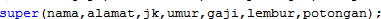

    `jawab`

    menjalankan constructor class parent dengan parameter yang disediakan

4. Apakah fungsi potongan program berikut pada class StaffHarian

    

    `jawab`

    untuk memanggil method yg ada di class parent

5. Perhatikan kode program dibawah ini yang terdapat pada class StaffTetap

    

    Terlihat dipotongan program diatas atribut gaji, lembur dan potongan dapat diakses langsung. Kenapa hal ini bisa terjadi dan bagaimana class StaffTetap memiliki atribut gaji, lembur, dan potongan padahal dalam class tersebut tidak dideklarasikan atribut gaji, lembur, dan potongan?

    `jawab`

    kara pada class parent atribut tersebut ber-modifier public senhingga dapat di akses oleh class lain yang merupakan anak dari class parent

## Tugas

Buatlah sebuah program dengan konsep pewarisan seperti pada class diagram berikut ini. Kemudian buatlah instansiasi objek untuk menampilkan data pada class Mac, Windows dan Pc!.

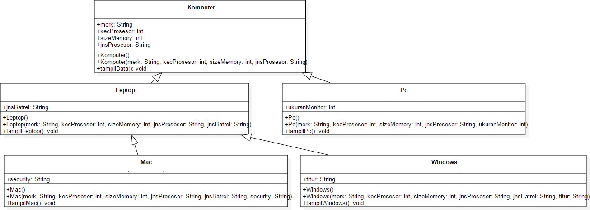

`Screenshot:`

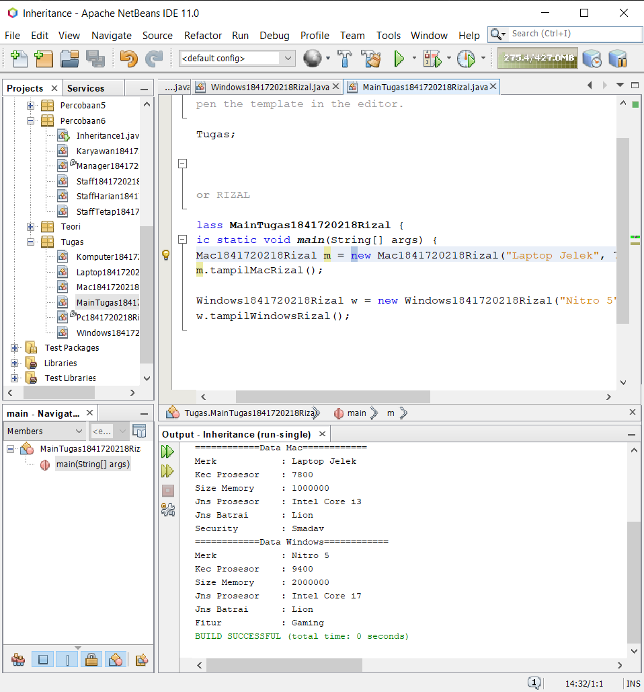

`Kode Program:`

* [Komputer1841720218Rizal](../../src/6_inheritance/Tugas/Komputer1841720218Rizal.java)

* [Laptop1841720218Rizal](../../src/6_inheritance/Tugas/Laptop1841720218Rizal.java)

* [Pc1841720218Rizal](../../src/6_inheritance/Tugas/Pc1841720218Rizal.java)

* [Mac1841720218Rizal](../../src/6_inheritance/Tugas/Mac1841720218Rizal.java)

* [Windows1841720218Rizal](../../src/6_inheritance/Tugas/Windows1841720218Rizal.java)

* [MainTugas1841720218Rizal](../../src/6_inheritance/Tugas/MainTugas1841720218Rizal.java)


## Kesimpulan

* Dapat Mengimplementasikan  Inheritance.
* Dapat Mengimplementasikan  Single Inheritance.
* Dapat Mengimplementasikan  Multilevel Inheritance.
* Dapat membuat super Konstraktor dan Mengimplementasikannya.

## Pernyataan Diri

Saya menyatakan isi tugas, kode program, dan laporan praktikum ini dibuat oleh saya sendiri. Saya tidak melakukan plagiasi, kecurangan, menyalin/menggandakan milik orang lain.

Jika saya melakukan plagiasi, kecurangan, atau melanggar hak kekayaan intelektual, saya siap untuk mendapat sanksi atau hukuman sesuai peraturan perundang-undangan yang berlaku.

Ttd,

***Rizal Anhari***