# Laporan Praktikum #7 - OVERLOADING DAN OVERRIDING

## Kompetensi

Setelah menempuh pokok bahasan ini, mahasiswa mampu :
* Memahami konsep overloading dan overriding,
* Memahami perbedaan overloading dan overriding,
* Ketepatan dalam mengidentifikasi method overriding dan overloading
* Ketepatan dalam mempraktekkan instruksi pada jobsheet
* Mengimplementasikan method overloading dan overriding.

## Ringkasan Materi

* Overloading
    adalah menuliskan kembali method dengan nama yang sama pada suatu class. Tujuannya dapat memudahkan penggunaan/pemanggilan method dengan fungsionalitas yang mirip. Untuk aturan pendeklarasian method Overloading sebagai berikut:
    * Nama method harus sama.
    * Daftar parameter harus berbeda.
    * Return type boleh sama, juga boleh berbeda.

* Overriding
    adalah Sublass yang berusaha memodifkasi tingkah laku yang diwarisi dari superclass. Tujuannya subclass dapat memiliki tingkah laku yang lebih spesifik sehingga dapat dilakukan dengan cara mendeklarasikan kembali method milik parent class di subclass.
    Deklarasi method pada subclass harus sama dengan yang terdapat di super class. Kesamaan pada:
    * Nama
    * Return type (untuk return type : class A atau merupakan subclass dari class A)
    * Daftar parameter (jumlah, tipe dan urutan)

## Ringkasan Materi

Inheritance atau pewarisan sifat merupakan suatu cara untuk menurunkan suatu class yang lebih umum menjadi suatu class yang lebih spesifik. Inheritance adalah salah satu ciri utama suatu bahasa program yang berorientasi pada objek. Inti dari pewarisan adalah sifat reusable dari konsep object oriented. Setiap subclass akan “mewarisi” sifat dari superclass selama bersifat protected ataupun public.

* Ciri-ciri
    * super.namaAtribut
    * super.namaMethod()
    * super()
    * super(parameter1, parameter2,dst)

## Percobaan

### Percobaan 1

`Class Diagram`

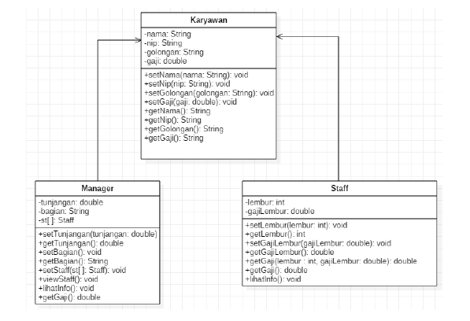

`Screenshot:`

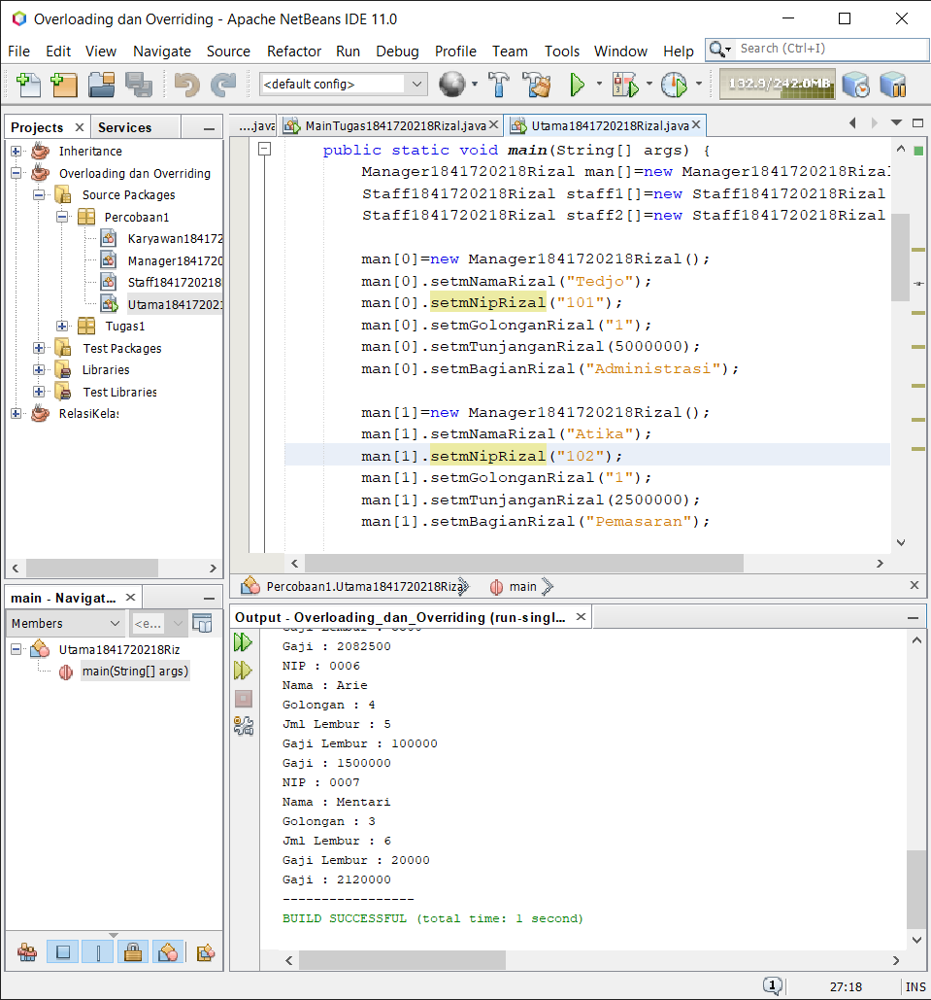

`Kode Program:`

* [Karyawan1841720218Rizal](../../src/7_Overriding_dan_Overloading/Percobaan1/Karyawan1841720218Rizal.java)
* [Manager1841720218Rizal](../../src/7_Overriding_dan_Overloading/Percobaan1/Manager1841720218Rizal.java)
* [Staff1841720218Rizal](../../src/7_Overriding_dan_Overloading/Percobaan1/Staff1841720218Rizal.java)
* [Utama1841720218Rizal](../../src/7_Overriding_dan_Overloading/Percobaan1/Utama1841720218Rizal.java)

## Latihan

`Kode Program:`

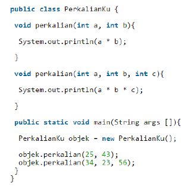

`Soal`

1. Dari source coding diatas terletak dimanakah overloading?

    `Jawab`

    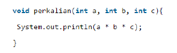

2. Jika terdapat overloading ada berapa jumlah parameter yang berbeda?

    `Jawab`

    Terdapat satu parameter yang berbeda yaitu **int c**

`Kode Program:`

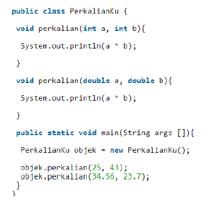

`Soal`

3. Dari source coding diatas terletak dimanakah overloading?

    `Jawab`

    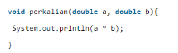

4. Jika terdapat overloading ada berapa tipe parameter yang berbeda?

    `Jawab`

    satu yaitu **boolean**

`Kode Program:`

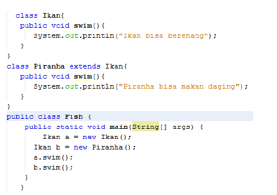

`Soal`

5. Dari source coding diatas terletak dimanakah overriding?

    `Jawab`

    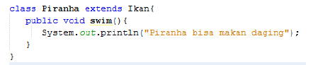

6. Jabarkanlah apabila sourcoding diatas jika terdapat overriding?

    `jawab`

    Jika pada main **a.swim** dieksekusi maka akan menapilkan **ikan bisa berenang**
    Jika pada main **b.swim** dieksekusi maka akan menapilkan **piranha bisa memakan daging**

## Tugas

### Tugas1

Implementasikan konsep overloading pada class diagram dibawah ini :

`Class Diangram Tugas 1`

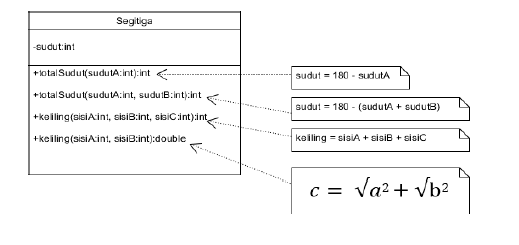

`ScreenShot:`

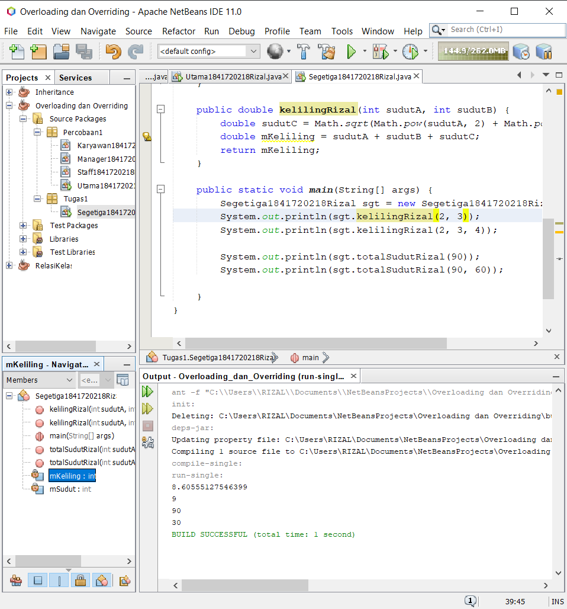

`Kode Program:`

* [Segetiga1841720218Rizal](../..\src\7_Overriding_dan_Overloading\Tugas1\Segetiga1841720218Rizal.java)

### Tugas2

`Class Diangram Tugas 2`

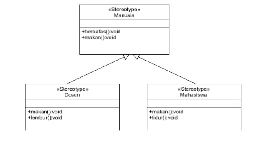

`ScreenShot:`

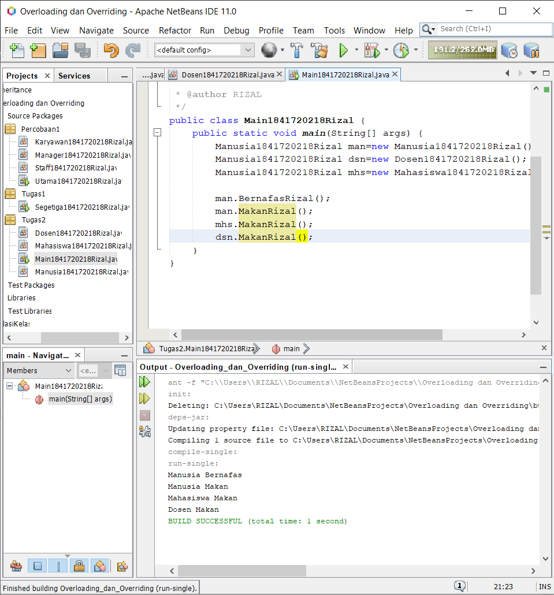

`Kode Program:`

* [Manusia1841720218Rizal](../..\src\7_Overriding_dan_Overloading\Tugas2\Manusia1841720218Rizal.java)

* [Dosen1841720218Rizal](../..\src\7_Overriding_dan_Overloading\Tugas2\Dosen1841720218Rizal.java)

* [Mahasiswa1841720218Rizal](../..\src\7_Overriding_dan_Overloading\Tugas2\Mahasiswa1841720218Rizal.java)

* [Main1841720218Rizal](../..\src\7_Overriding_dan_Overloading\Tugas2\Main1841720218Rizal.java)

## Kesimpulan

* Mengimplementasika overloading dan overriding

## Pernyataan Diri

Saya menyatakan isi tugas, kode program, dan laporan praktikum ini dibuat oleh saya sendiri. Saya tidak melakukan plagiasi, kecurangan, menyalin/menggandakan milik orang lain.

Jika saya melakukan plagiasi, kecurangan, atau melanggar hak kekayaan intelektual, saya siap untuk mendapat sanksi atau hukuman sesuai peraturan perundang-undangan yang berlaku.

Ttd,

***Rizal Anhari***