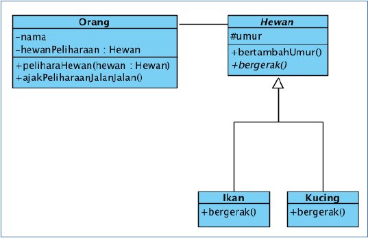
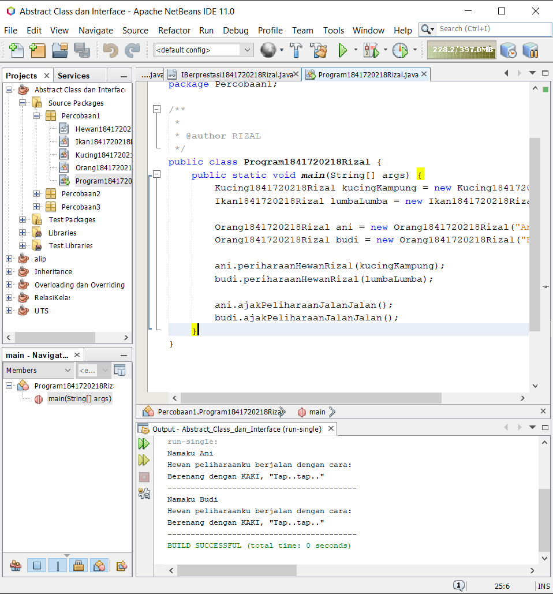
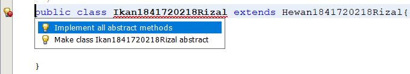
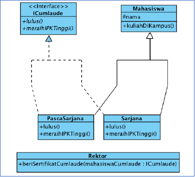
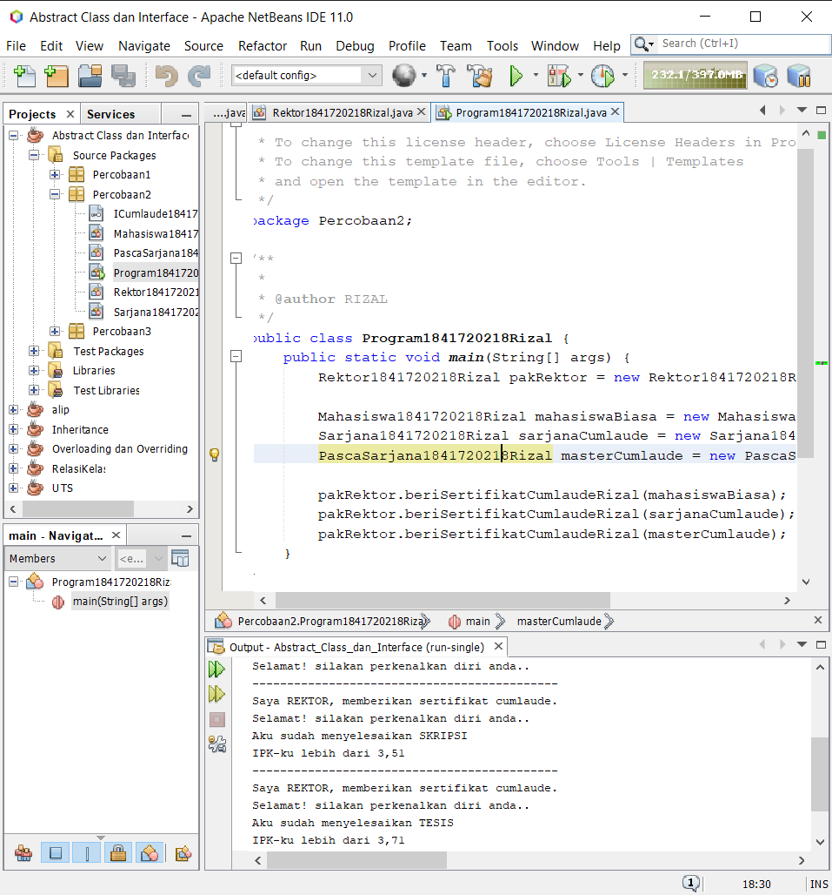
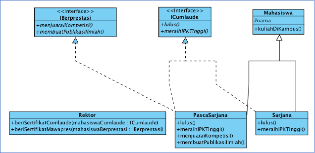
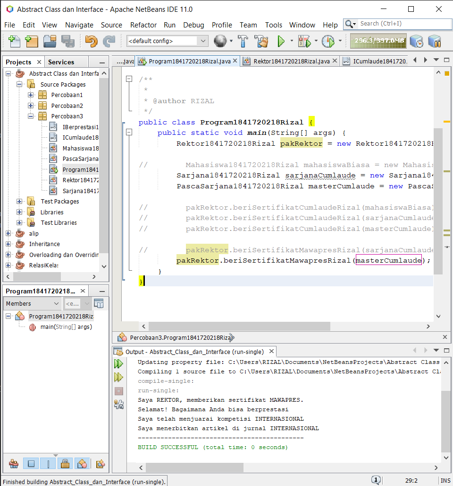
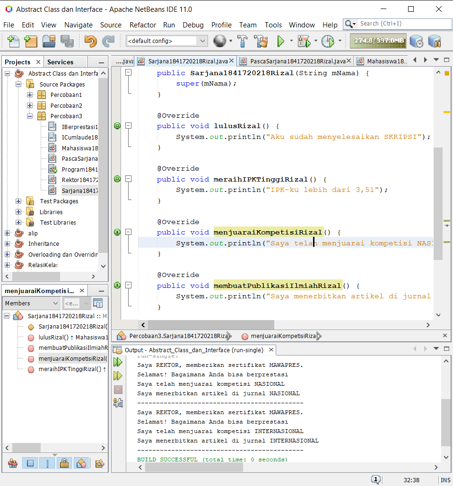

# Laporan Praktikum #9 - ABSTRACT CLASS DAN INTERFACE

## Kompetensi

Setelah menyelesaikan lembar kerja ini mahasiswa diharapkan mampu:

1. Menjelaskan maksud dan tujuan penggunaan Abstract Class
2. Menjelaskan maksud dan tujuan penggunaan Interface
3. Menerapkan Abstract Class dan Interface di dalam pembuatan program

## Ringkasan Materi

* Abstract Class

    Abstract Class adalah class yang tidak dapat diinstansiasi namun dapat di-extend. Abstract class baru dapat dimanfaatkan ketika ia di-extend.

    * Karakteristik:

        * Dapat memiliki properties dan methods seperti class biasa.
        * Selalu memiliki methods yang tidak memiliki tubuh (hanya deklarasinya saja), disebut juga abstract method.
        * Selalu dideklarasikan dengan menggunakan kata kunci abstract class.

    * Kegunaan:

        Menggambarkan sesuatu yang bersifat umum, yang hanya bisa berfungsi setelah ia dideskripsikan ke dalam bentuk yang lebih spesifik.

* Interface

    Interface adalah struktur data yang hanya berisi abstract methods. Tidak ada apa-apa selain method abstract pada interface, termasuk atribut getter dan setter.

    * Karakteristik:

        * Tidak ada apa-apa di dalamnya selain abstract methods.
        * Di konvensi bahasa pemrograman Java, namanya dianjurkan untuk selalu diawali dengan huruf kapital ‘I’.
        * Selalu dideklarasikan dengan menggunakan kata kunci interface.
        * Diimplementasikan dengan menggunakan kata kunci implements.

    * Kegunaan:

        Bertindak seperti semacam kontrak/syarat yang HARUS dipenuhi bagi suatu class agar class tersebut dapat dianggap sebagai ‘sesuatu yang lain’.

## Percobaan

### Percobaan 1

`Class Diagram`



`Screenshot:`



`Kode Program:`

* [Hewan1841720218Rizal](../../src/9_Abstract_Class_dan_Interface/Percobaan1/Hewan1841720218Rizal.java)
* [Ikan1841720218Rizal](../../src/9_Abstract_Class_dan_Interface/Percobaan1/Ikan1841720218Rizal.java)
* [Kucing1841720218Rizal](../../src/9_Abstract_Class_dan_Interface/Percobaan1/Kucing1841720218Rizal.java)
* [Orang1841720218Rizal](../../src/9_Abstract_Class_dan_Interface/Percobaan1/Orang1841720218Rizal.java)
* [Program1841720218Rizal](../../src/9_Abstract_Class_dan_Interface/Percobaan1/Program1841720218Rizal.java)

`Pertanyaan Diskusi`

Bolehkah apabila sebuah class yang meng-extend suatu abstract class tidak mengimplementasikan method abstract yang ada di class induknya? Buktikan!

`jawab`

Tidak boleh, jika suatu class me-extend class abstact maka harus me-override method abstact atau merubah child class menjadi class abstact


### Percobaan 2

`Class Diagram`



`Screenshot:`



`Kode Program:`

* [ICumlaude1841720218Rizal](../../src/9_Abstract_Class_dan_Interface/Percobaan2/ICumlaude1841720218Rizal.java)
* [Mahasiswa1841720218Rizal](../../src/9_Abstract_Class_dan_Interface/Percobaan2/Mahasiswa1841720218Rizal.java)
* [PascaSarjana1841720218Rizal](../../src/9_Abstract_Class_dan_Interface/Percobaan2/PascaSarjana1841720218Rizal.java)
* [Program1841720218Rizal](../../src/9_Abstract_Class_dan_Interface/Percobaan2/Program1841720218Rizal.java)
* [Rektor1841720218Rizal](../../src/9_Abstract_Class_dan_Interface/Percobaan2/Rektor1841720218Rizal.java)
* [Sarjana1841720218Rizal](../../src/9_Abstract_Class_dan_Interface/Percobaan2/Sarjana1841720218Rizal.java)

`Pertanyaan Diskusi`

1. Mengapa pada langkah nomor 9 terjadi error? Jelaskan!
2. Dapatkah method kuliahDiKampus() dipanggil dari objek sarjanaCumlaude di class Program? Mengapa demikian?
3. Dapatkah method kuliahDiKampus() dipanggil dari parameter mahasiswa di method beriSertifikatCumlaude() pada class Rektor? Mengapa demikian?
4. Modifikasilah method beriSertifikatCumlaude() pada class Rektor agar hasil eksekusi class Program menjadi seperti berikut ini:

`jawab`

1. Karena pada class mahasiswa tidak me-implemen class ICumlaude tidak dapat menjalankan method berisertifikatcumlaude pada class rektor yang berparameter objek dari class ICumlaude

2. Bisa karena sarjanaCumlaude sudah me-extends mahasiswa

3. Bisa, jika mengubah parameter method beriSertifikanCumlaude dengan objek class Mahasiswa

4. Kode Program

``` 
   public void beriSertifikatCumlaudeRizal(Mahasiswa1841720218Rizal mahasiswa){
        System.out.println("Saya REKTOR, memberikan sertifikat cumlaude.");
        System.out.println("Selamat! silakan perkenalkan diri anda..");
        
        mahasiswa.kuliahDiKampusRizal();
        mahasiswa.lulusRizal();
        mahasiswa.meraihIPKTinggiRizal();
        
        System.out.println("--------------------------------------------");
    } 
```

### Percobaan 3

`Class Diagram`



`Screenshot:`



`Kode Program:`

* [ICumlaude1841720218Rizal](../../src/9_Abstract_Class_dan_Interface/Percobaan3/ICumlaude1841720218Rizal.java)
* [Mahasiswa1841720218Rizal](../../src/9_Abstract_Class_dan_Interface/Percobaan3/Mahasiswa1841720218Rizal.java)
* [PascaSarjana1841720218Rizal](../../src/9_Abstract_Class_dan_Interface/Percobaan3/PascaSarjana1841720218Rizal.java)
* [Program1841720218Rizal](../../src/9_Abstract_Class_dan_Interface/Percobaan3/Program1841720218Rizal.java)
* [Rektor1841720218Rizal](../../src/9_Abstract_Class_dan_Interface/Percobaan3/Rektor1841720218Rizal.java)
* [Sarjana1841720218Rizal](../../src/9_Abstract_Class_dan_Interface/Percobaan3/Sarjana1841720218Rizal.java)
* [IBerprestasi1841720218Rizal](../../src/9_Abstract_Class_dan_Interface/Percobaan3/IBerprestasi1841720218Rizal.java)

`Pertanyaan Diskusi`

Apabila Sarjana Berprestasi harus menjuarai kompetisi NASIONAL dan menerbitkan artikel di jurnal NASIONAL, maka modifikasilah class-class yang terkait pada aplikasi Anda agar di class Program objek pakRektor dapat memberikan sertifikat mawapres pada objek sarjanaCumlaude.

`jawab`

Kode Program

```
public class Sarjana1841720218Rizal extends Mahasiswa1841720218Rizal implements  ICumlaude1841720218Rizal, IBerprestasi1841720218Rizal{

    public Sarjana1841720218Rizal(String mNama) {
        super(mNama);
    }
    
    @Override
    public void lulusRizal() {
        System.out.println("Aku sudah menyelesaikan SKRIPSI");
    }

    @Override
    public void meraihIPKTinggiRizal() {
        System.out.println("IPK-ku lebih dari 3,51");
    }

    @Override
    public void menjuaraiKompetisiRizal() {
        System.out.println("Saya telah menjuarai kompetisi NASIONAL");
    }

    @Override
    public void membuatPublikasiIlmiahRizal() {
        System.out.println("Saya menerbitkan artikel di jurnal NASIONAL");
    }
    
}
```



## Kesimpulan

* Mengimplementasika Abstract Class dan interface

## Pernyataan Diri

Saya menyatakan isi tugas, kode program, dan laporan praktikum ini dibuat oleh saya sendiri. Saya tidak melakukan plagiasi, kecurangan, menyalin/menggandakan milik orang lain.

Jika saya melakukan plagiasi, kecurangan, atau melanggar hak kekayaan intelektual, saya siap untuk mendapat sanksi atau hukuman sesuai peraturan perundang-undangan yang berlaku.

Ttd,

***Rizal Anhari***